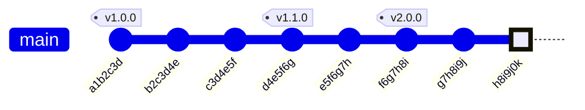

# 资源
> [git](https://git-scm.com/docs/)  

# git bash 修改时区

先查看当前时间是否正确：
```bash
lxw@lx MINGW64 /e/src_git/demo (develop)
$ date
Fri Jan 17 06:41:27 GMT 2025
```

修改 `TZ` 变量，注意这里时区设置和 linux 中格式有区别 (linux 中国时区为 `Asia/Shanghai`)
```bash
export TZ="CST-8"
```

永久修改则在配置文件中修改，如当前用户修改可在 `~/.bashrc` 中设置
修改完后 `. ~/.bashrc` 时期生效，再用 date 命令查看，时区已修改成功：
```bash
lxw@lx MINGW64 /e/src_git/demo (develop)
$ date
Fri Jan 17 14:46:31 CST 2025
```

# git bash 中为常用命令设置别名

希望全局配置，可以在 `/etc/profile.d/aliases.sh` 中添加。
针对当前用户配置，在 `$HOME/.bashrc` 中添加。

```bash
alias stashsuobin='git diff --name-only | grep -E "\.(suo|bin)$" | xargs git stash push -m ".suo and .bin files" '
alias restoresuobin='git status --porcelain | cut -d" " -f3- |  grep -E "\.(suo|bin)$" | xargs git restore -- '
alias checkSkipWorktree=' git ls-files -v | grep "^S"'

alias addUnchanged='git update-index --assume-unchanged '
alias cancelAllSkipWorktree='git ls-files -v | grep "^S" | cut -d" " -f2 | xargs git update-index --no-skip-worktree '
alias cancelAllUnchangedSkipWorktree='git ls-files -v | grep "^[S|s]" | cut -d" " -f2 | xargs git update-index --no-skip-worktree '
alias cancelSkipWorktree='git update-index --no-skip-worktree '
alias cancelUnchanged='git update-index --no-assume-unchanged '
alias checkDeletedLog='git fsck --unreachable | grep commit | cut -d" " -f3 | xargs git log --merges --no-walk --oneline '
alias checkSkipWorktree='git ls-files -v | grep "^S" '
alias checkUnchangedSkipWorktree=' git ls-files -v | grep "^[S|s]" '
alias restoreStashCommit='git update-ref --create-reflog refs/stash '
```

# 修改 log 时区
修改时区以便用 git log 查看日志时的时间和系统时间处于一个时区：
```bash
git config --global log.date=local
```

# git remote

## 查看远程仓库名称列表
```bash
lx@lx MINGW64 /d/Documents/git_test04 (main2)
$ git remote
origin
```

## 查看远程仓库URL
```bash
lx@lx MINGW64 /d/Documents/git_test04 (main2)
$ git remote -vv
origin  https://github.com/lxwcd/git_test.git (fetch)
origin  https://github.com/lxwcd/git_test.git (push)
```

## 添加本地远程仓库
```bash
git remote add local-origin file:///d/Documents/git_test
```
- 将 `D:/Documents/git_test` 仓库添加为远程仓库，别名为 `local-origin`。

# git status 查看文件状态

```bash
lx@lx MINGW64 /d/Documents/git_test (fix_B)
$ git --version
git version 2.47.1.windows.1

lx@lx MINGW64 /d/Documents/git_test (fix_B)
$ git status
On branch fix_B
Changes to be committed:
  (use "git restore --staged <file>..." to unstage)
        new file:   git.md

Changes not staged for commit:
  (use "git add <file>..." to update what will be committed)
  (use "git restore <file>..." to discard changes in working directory)
        modified:   git.md
        modified:   test01.txt

Untracked files:
  (use "git add <file>..." to include in what will be committed)
        0001-commit-B.patch
        0001-fix-B.patch
        0001-update-fix_B.patch
        0002-commit-C.patch
        0002-update-fix_B.patch
        1.patch
```

## -s, --short 显示简短的状态信息
不显示文件的具体更改内容。

```bash
lx@lx MINGW64 /d/Documents/git_test (fix_B)
$ git status -s
A  git.md
 M test01.txt
?? 0001-commit-B.patch
?? 0001-fix-B.patch
?? 0001-update-fix_B.patch
?? 0002-commit-C.patch
?? 0002-update-fix_B.patch
?? 1.patch
```

## -u, --untracked-files[=<mode>] 显示未跟踪的文件
`<mode>` 可以是 `no`, `normal`, 或 `all`
     - `no`：不显示未跟踪的文件。
     - `normal`：显示未跟踪的文件，但排除那些在 `.gitignore` 中指定的文件。
     - `all`：显示所有未跟踪的文件，包括那些在 `.gitignore` 中指定的文件。

```bash
lx@lx MINGW64 /d/Documents/git_test (fix_B)
$ git status --short --untracked-files=no
A  git.md
 M test01.txt
```

## 输出未被跟踪的文件名
```bash
lx@lx MINGW64 /d/Documents/git_test (fix_B)
$ git status -s
AM git.md
 M test01.txt
?? .gitignore
?? 0001-commit-B.patch
?? 0001-fix-B.patch
?? 0001-update-fix_B.patch
?? 0002-commit-C.patch
?? 0002-update-fix_B.patch
?? 1.patch
?? 2.txt

lx@lx MINGW64 /d/Documents/git_test (fix_B)
$ git status -s |  grep "??" | cut -d" " -f2
.gitignore
0001-commit-B.patch
0001-fix-B.patch
0001-update-fix_B.patch
0002-commit-C.patch
0002-update-fix_B.patch
1.patch
2.txt
```

# Author and Committer
> [Why is git AuthorDate different from CommitDate?](https://stackoverflow.com/questions/11856983/why-is-git-authordate-different-from-commitdate) 
> [Git - Viewing the Commit History](https://git-scm.com/book/en/v2/Git-Basics-Viewing-the-Commit-History) 

> You may be wondering what the difference is between author and committer. The author is the person who originally wrote the work, whereas the committer is the person who last applied the work. So, if you send in a patch to a project and one of the core members applies the patch, both of you get credit — you as the author, and the core member as the committer. 
  
# git date
> [Dates in Git - Azure Repos](https://learn.microsoft.com/en-us/azure/devops/repos/git/git-dates?view=azure-devops) 

## Author Date
作者时间是指提交的作者（Author）创建提交时的时间戳。它记录了最初编写代码并创建提交的时间。

在正常的 git commit 操作中，作者时间和提交者时间是相同的。

### 查看 Author Date
> [Git - Viewing the Commit History](https://git-scm.com/book/en/v2/Git-Basics-Viewing-the-Commit-History#pretty_format) 

```bash
lx@lx MINGW64 /d/Documents/git_test04 (fix_B)
$ git log --pretty=fuller  -1
commit baddcc29cc6f0cd12a793ad33f8caa198c97bcaa (HEAD -> fix_B)
Author:     John <John@163.com>
AuthorDate: Sun Feb 9 20:46:40 2025 +0800
Commit:     lxwcd <15521168075@163.com>
CommitDate: Sun Feb 9 21:00:08 2025 +0800

    add files and modify author
```

```bash
lx@lx MINGW64 /d/Documents/git_test04 (main3)
$ git log --pretty=format:"%h %an %ad" fix_C -1
b3e36b5 John Sun Feb 9 20:46:40 2025 +0800
```
%h：提交的哈希值（短格式）
%an：作者名称（Author Name）
%ad：作者时间（Author Date）

### git commit --date 修改 Author date
```bash
lx@lx MINGW64 /d/Documents/git_test04 (fix_D)
$ date
2025年02月 9日 21:17:02
```

```bash
lx@lx MINGW64 /d/Documents/git_test04 (fix_D)
$ git commit --date="2025-01-02 14:00:00" -m "Fix bug" --author="Alice <ALice@163.com>"
[fix_D 91b0e3c] Fix bug
 Author: Alice <ALice@163.com>
 Date: Thu Jan 2 14:00:00 2025 +0800
 1 file changed, 1 insertion(+)
```

查看日志，Author Date 被修改为指定时间，但 commit date 为当前时间。
```bash
lx@lx MINGW64 /d/Documents/git_test04 (fix_D)
$ git log --pretty=fuller -1
commit 91b0e3c6432ccf89a9809c087fe933bf05c6966e (HEAD -> fix_D)
Author:     Alice <ALice@163.com>
AuthorDate: Thu Jan 2 14:00:00 2025 +0800
Commit:     lxwcd <15521168075@163.com>
CommitDate: Sun Feb 9 21:17:51 2025 +0800

    Fix bug
```

### git cherry-pick 不会修改 Author date
`git cherry-pick` 没有使用 `--no-commit` 选项，且没有冲突，不会修改作者时间戳，但会更新提交时间。

fix_C 分支有一个提交记录：
```bash
lx@lx MINGW64 /d/Documents/git_test04 (fix_C)
$ git log --pretty=fuller -1
commit b3e36b570b1067a9a3bf6e57fe33589afbfdb31c (HEAD -> fix_C)
Author:     John <John@163.com>
AuthorDate: Sun Feb 9 20:46:40 2025 +0800
Commit:     lxwcd <15521168075@163.com>
CommitDate: Sun Feb 9 20:46:40 2025 +0800

    add files and modify author
```

`git cherry-pick` 应用该提交到 fix_B 分支：
```bash
lx@lx MINGW64 /d/Documents/git_test04 (fix_B)
$ git cherry-pick fix_C
[fix_B baddcc2] add files and modify author
 Author: John <John@163.com>
 Date: Sun Feb 9 20:46:40 2025 +0800
 24 files changed, 390 insertions(+)
```

查看 fix_B 分支的提交记录，发现提交时间更新了，但 Author Date 没有更新：
```cpp
lx@lx MINGW64 /d/Documents/git_test04 (fix_B)
$ git log --pretty=fuller  -1
commit baddcc29cc6f0cd12a793ad33f8caa198c97bcaa (HEAD -> fix_B)
Author:     John <John@163.com>
AuthorDate: Sun Feb 9 20:46:40 2025 +0800
Commit:     lxwcd <15521168075@163.com>
CommitDate: Sun Feb 9 21:00:08 2025 +0800

    add files and modify author
```

### git cherry-pick 解决冲突后不修改 Author Date
`git cherry-pick` 如果有冲突，根据提示和 git status 查看的状态打开冲突文件解决冲突。
```bash

lx@lx MINGW64 /d/Documents/git_test04 (main2_01)
$ git cherry-pick main2
Auto-merging test01.txt
CONFLICT (content): Merge conflict in test01.txt
error: could not apply 3b671ba... modify test01.txt , add C
hint: After resolving the conflicts, mark them with
hint: "git add/rm <pathspec>", then run
hint: "git cherry-pick --continue".
hint: You can instead skip this commit with "git cherry-pick --skip".
hint: To abort and get back to the state before "git cherry-pick",
hint: run "git cherry-pick --abort".
hint: Disable this message with "git config advice.mergeConflict false"
```

```bash
lx@lx MINGW64 /d/Documents/git_test04 (main2_01|CHERRY-PICKING)
$ git status
On branch main2_01
You are currently cherry-picking commit 3b671ba.
  (fix conflicts and run "git cherry-pick --continue")
  (use "git cherry-pick --skip" to skip this patch)
  (use "git cherry-pick --abort" to cancel the cherry-pick operation)

Unmerged paths:
  (use "git add <file>..." to mark resolution)
        both modified:   test01.txt

no changes added to commit (use "git add" and/or "git commit -a")
```

解决冲突后 `git add` 将文件添加到暂存区，然后 `git cherry-pick --continue` 继续执行 cherry-pick 操作，这时会打开窗口写提交日志信息，默认显示原始的日志，可以直接使用或者修改日志 message：
```bash
modify test01.txt , add C

# Conflicts:
#	test01.txt
#
# It looks like you may be committing a cherry-pick.
# If this is not correct, please run
#	git update-ref -d CHERRY_PICK_HEAD
# and try again.


# Please enter the commit message for your changes. Lines starting
# with '#' will be ignored, and an empty message aborts the commit.
#
# Author:    Bob <Bob@163.com>
# Date:      Sun Feb 9 18:58:12 2025 +0800
#
# On branch main2_01
# You are currently cherry-picking commit 3b671ba.
#
# Changes to be committed:
#	modified:   test01.txt
#
```

完成后查看日志发现 Author Date 没有被修改，但 Commit Date 更新为当前时间：
```bash
lx@lx MINGW64 /d/Documents/git_test04 (main2_01)
$ git log --pretty=fuller -1
commit f537c63676cc209de5bdcd1b79ba79234c7d1552 (HEAD -> main2_01)
Author:     Bob <Bob@163.com>
AuthorDate: Sun Feb 9 18:58:12 2025 +0800
Commit:     lxwcd <15521168075@163.com>
CommitDate: Sun Feb 9 22:32:24 2025 +0800

    modify test01.txt , add C
```

### git cherry-pick --no-commit 修改 Author date
如果 git cherry-pick --no-commit 则会自己提交，因此改变作者信息和时间：

fix_C 分支有一个提交记录：
```bash
lx@lx MINGW64 /d/Documents/git_test04 (fix_C)
$ git log --pretty=fuller -1
commit b3e36b570b1067a9a3bf6e57fe33589afbfdb31c (HEAD -> fix_C)
Author:     John <John@163.com>
AuthorDate: Sun Feb 9 20:46:40 2025 +0800
Commit:     lxwcd <15521168075@163.com>
CommitDate: Sun Feb 9 20:46:40 2025 +0800

    add files and modify author
```

`git cherry-pick` 应用该提交到 main3 分支：
```bash
lx@lx MINGW64 /d/Documents/git_test04 (main3)
$ git cherry-pick fix_C --no-commit

```

手动提交：
```cpp
lx@lx MINGW64 /d/Documents/git_test04 (main3)
$ git commit -m "cherry-pick fix_C and commit manually"
[main3 d228105] cherry-pick fix_C and commit manually
 24 files changed, 390 insertions(+)
```

查看日志发现作者时间戳和提交时间戳都更新了：
```bash
lx@lx MINGW64 /d/Documents/git_test04 (main3)
$ git log --pretty=fuller  -1
commit d228105d37848565b1ab948a8ae5d12c32bdb10f (HEAD -> main3)
Author:     lxwcd <15521168075@163.com>
AuthorDate: Sun Feb 9 21:05:30 2025 +0800
Commit:     lxwcd <15521168075@163.com>
CommitDate: Sun Feb 9 21:05:30 2025 +0800

    cherry-pick fix_C and commit manually
```

### git rebase 和 git cherry-pick 影响相同

## Commit Date
提交者时间是指提交被最终记录到仓库中的时间戳。它记录了提交被实际写入 Git 历史的时间。

在正常的 git commit 操作中，提交者时间和作者时间是相同的。

### 查看 Commit Date 
> [Git - Viewing the Commit History](https://git-scm.com/book/en/v2/Git-Basics-Viewing-the-Commit-History#pretty_format) 

```bash
lx@lx MINGW64 /d/Documents/git_test04 (fix_D)
$ git log --pretty=fuller  -1 fix_C
commit b3e36b570b1067a9a3bf6e57fe33589afbfdb31c (fix_C)
Author:     John <John@163.com>
AuthorDate: Sun Feb 9 20:46:40 2025 +0800
Commit:     lxwcd <15521168075@163.com>
CommitDate: Sun Feb 9 20:46:40 2025 +0800

    add files and modify author
```

或者：
```bash
lx@lx MINGW64 /d/Documents/git_test04 (fix_D)
$ git log --pretty=format:"%h %cn %cd" fix_C -1
b3e36b5 lxwcd Sun Feb 9 20:46:40 2025 +0800
```

%cn：提交者名称（Committer Name）
%cd：提交者时间（Committer Date）

### git cherry-pick 和 git rebase 更新 commit 时间戳
在 git rebase 或 git cherry-pick 等操作中，提交者时间会更新为当前时间，因为这些操作会重新生成提交对象。

## Push Date
> [Dates in Git - Azure Repos](https://learn.microsoft.com/en-us/azure/devops/repos/git/git-dates?view=azure-devops) 

推送时间是指提交被推送到远程仓库的时间。Git 本身并没有直接记录推送时间，但可以通过一些工具或远程仓库的记录来查看。

推送时间通常由远程仓库（如 GitHub、GitLab 等）记录，而不是直接存储在 Git 提交对象中。

每次执行 git push 时，远程仓库会记录推送的时间戳。

# HEAD  
> [Git - Reset Demystified](https://git-scm.com/book/en/v2/Git-Tools-Reset-Demystified#_git_reset)  
> [Git - Git References](https://git-scm.com/book/en/v2/Git-Internals-Git-References#:~:text=want%20to%20create.-,The%20HEAD,-The%20question%20now)  
      
HEAD is the pointer to the current branch reference, which is in turn a pointer to the last commit made on that branch. That means HEAD will be the parent of the next commit that is created. It’s generally simplest to think of HEAD as the snapshot of your last commit on that branch.  
      
## `HEAD` 的作用  
      
1. **指向当前分支**：`HEAD` 通常指向当前分支的引用，比如 `master` 或 `feature`。当你检出（checkout）一个分支时，`HEAD` 会更新为指向该分支的最新提交。  
2. **确定工作目录**：`HEAD` 指向的提交决定了你的工作目录的内容。当你检出不同的提交时，工作目录会更新以反映该提交时的文件状态。  
3. **暂存区的基础**：`HEAD` 也用作暂存区（staging area）的基础。当你添加（add）更改到暂存区时，这些更改是相对于 `HEAD` 指向的提交进行的。  
      
## `HEAD` 的工作方式  
      
- **引用文件**：在 `.git` 目录中，`HEAD` 是一个文件，通常包含对当前分支的引用。例如，`HEAD` 文件可能包含 `ref: refs/heads/master`，表示 `HEAD` 指向 `master` 分支。  
- **更新 `HEAD`**：当你执行 `git checkout <branch>` 或 `git commit` 等命令时，`HEAD` 会更新为指向新的分支或新的提交。  
      
### 使用 `HEAD`  
      
- **查看 `HEAD`**：  
  ```bash  
  cat .git/HEAD  
  ```
  这个命令显示 `HEAD` 文件的内容，通常是一个指向当前分支的引用。  
      
- **检出 `HEAD`**：  
  ```bash  
  git checkout HEAD  
  ```
  这个命令将工作目录恢复到 `HEAD` 指向的提交状态。  
      
- **比较 `HEAD`**：  
  ```bash  
  git diff HEAD  
  ```
  这个命令显示自 `HEAD` 指向的提交以来工作目录中的更改。  
      
## 查看当前分支的 `HEAD`  
### 1. 使用 `git log`  
      
运行以下命令来查看当前分支的最新提交，这通常是 `HEAD` 指向的提交：  
      
```bash  
git log -1  
```
      
这个命令显示最近一次提交的详细信息，包括提交哈希、作者、日期和提交信息。  
      
### 2. 使用 `git show`  
      
如果你想查看 `HEAD` 指向的提交的详细内容，可以使用：  
      
```bash  
git show HEAD  
```
      
这个命令显示 `HEAD` 指向的提交的详细信息，包括更改的内容。  
      
### 3. 使用 `git rev-parse`  
      
要获取 `HEAD` 指向的提交的哈希值，可以使用：  
      
```bash  
git rev-parse HEAD  
```
      
这个命令输出 `HEAD` 指向的提交的哈希值。  
      
### 4. 查看 `.git/HEAD` 文件  
      
如果你想直接查看 `HEAD` 文件的内容，可以使用：  
      
```bash  
cat .git/HEAD  
```
      
这个命令显示 `HEAD` 文件的内容，通常是一个指向当前分支的引用，如 `ref: refs/heads/main`。  
      
### 5. 使用 `git status`  
      
运行以下命令来查看当前分支的状态，包括 `HEAD` 指向的提交：  
      
```bash  
git status  
```
      
这个命令显示当前分支的状态，包括 `HEAD` 指向的提交和任何未提交的更改。  
      
## HEAD^  
      
- **定义**：`HEAD^`（读作 "HEAD caret"）引用 `HEAD` 指向的提交的父提交。如果有多个父提交（例如，在合并提交中），`HEAD^` 引用第一个父提交。  
- **用途**：用于指定 `HEAD` 的直接父提交。这在查看提交历史或执行需要指定特定提交的操作时非常有用。  
- **示例**：`git log HEAD^` 会显示 `HEAD` 的父提交的详细信息。  
      
## HEAD~  
      
- **定义**：`HEAD~`（读作 "HEAD tilde"）是 `HEAD` 的简写形式，通常用于指定 `HEAD` 指向的提交的父提交。`HEAD~` 与 `HEAD^` 在大多数情况下是等效的。  
- **用途**：用于指定 `HEAD` 的父提交，特别是在需要简洁引用时。  
- **示例**：`git log HEAD~` 会显示 `HEAD` 的父提交的详细信息。  
      
### HEAD~n  
      
- **定义**：`HEAD~n`（其中 `n` 是一个正整数）引用 `HEAD` 指向的提交的第 `n` 个父提交。例如，`HEAD~3` 引用 `HEAD` 的第三个父提交。  
- **用途**：用于指定 `HEAD` 的祖先提交。这在查看提交历史或执行需要指定特定提交的操作时非常有用。  
- **示例**：`git log HEAD~3` 会显示 `HEAD` 的第三个父提交的详细信息。  
      
## Detached HEAD  
> [Git - git-checkout Documentation](https://git-scm.com/docs/git-checkout#_detached_head) 

> In Git, a detached head occurs when you check out a commit directly using its hash instead of a branch name. This leaves your repository’s HEAD pointer pointing directly at that commit, rather than being linked to a specific branch. To view the history and changes made in a detached head, use git log or git show. If you want to see the differences between the current detached head and another branch, use git diff <branch>. A detached head can be a useful temporary state for exploring specific commits or features, but it’s essential to merge those changes back into a branch before sharing them with others.  
      
在 Git 中，detached HEAD 状态是指 HEAD 指针直接指向一个具体的提交，而不是指向一个分支。这种状态通常在以下几种情况下发生：  
使用 git checkout <commit-hash> 命令切换到某个特定的提交。  
使用 git checkout origin/<branch> 命令切换到远程分支，但本地没有对应的分支。  
使用 git checkout <tag> 命令切换到某个标签。  
      
在 detached HEAD 状态下，你可以进行正常的 Git 操作，如提交、合并、重置等。但需要注意以下几点：  
提交的引用：在 detached HEAD 状态下进行的提交不会关联到任何分支，因此这些提交可能会变得不可访问。你可以通过查看 Git 的引用日志（git reflog）来找回这些提交。  
      
当在 detached HEAD 状态下进行提交时，这些提交不会关联到任何分支。HEAD 直接指向这些提交，而不是通过分支引用指向它们。因此，如果切换到其他分支，这些提交将不会被自动保留。  
      
在 detached HEAD 状态下，可以创建一个新的分支来保留当前状态：  
bash  
```bash  
git checkout -b new-branch  
```
      
## 使用场景  
      
- **查看提交历史**：使用 `git log HEAD^` 或 `git log HEAD~` 查看 `HEAD` 的父提交的历史。  
- **比较提交**：使用 `git diff HEAD^` 或 `git diff HEAD~` 比较 `HEAD` 和其父提交之间的差异。  
- **撤销提交**：使用 `git reset --soft HEAD^` 撤销最后一次提交，但保留工作目录和暂存区的状态。  
在 Git 中，`HEAD` 是一个非常重要的概念，它指向当前分支的最新提交。`HEAD` 及其相关语法（如 `HEAD~3`）用于引用特定的提交。以下是关于 `HEAD` 及其语法的详细讲解：  
      
### 总结  
      
`HEAD`、`HEAD^`、`HEAD~` 和 `HEAD~n` 是 Git 中用于引用提交的强大工具。它们帮助你指定和操作特定的提交及其关系。理解这些概念对于有效使用 Git 进行版本控制和历史管理至关重要。  
      
      
## `HEAD` 的重要性  
      
- **版本控制的基础**：`HEAD` 是 Git 版本控制的核心，它决定了你正在工作的版本和状态。  
- **分支和合并**：在分支和合并操作中，`HEAD` 用于确定当前的工作基础和合并的目标。  
      
## 注意事项  
      
- **`HEAD` 与 `ORIG_HEAD`**：在某些操作（如合并冲突解决）中，Git 会创建一个 `ORIG_HEAD` 引用，以保存原始 `HEAD` 的状态，以便在需要时可以恢复。  
- **`HEAD` 与 `FETCH_HEAD`**：`FETCH_HEAD` 用于记录 `git fetch` 操作的结果，与 `HEAD` 不同，它通常用于比较和合并操作。  
      

# git log 查看日志
> [Git - git-log Documentation](https://git-scm.com/docs/git-log)  
> [Git - Viewing the Commit History](https://git-scm.com/book/en/v2/Git-Basics-Viewing-the-Commit-History)  
> [Git Log Command Explained](https://www.freecodecamp.org/news/git-log-command/)  
      
1. **查看提交历史**：`git log` 显示项目的提交历史记录，包括提交信息、作者、日期等。  
2. **过滤和格式化**：通过各种选项，可以过滤特定的提交记录、格式化输出内容等。  
      
## 选项  
      
- **`--summary`**：显示每个提交的简要总结。  
- **`--stat`**：显示每个提交的统计信息，包括文件更改数量。  
- **`--shortstat`**：以更简洁的格式显示统计信息。  
- **`--name-only`**：仅显示提交中更改的文件名。  
- **`--name-status`**：显示文件名及其更改状态（如 A 表示添加，M 表示修改）。  
- **`--pretty=format:"<format>"`**：自定义输出格式。例如：  
  ```bash  
  git log --pretty=format:"%h - %an, %ar : %s"  
  ```
  这个命令自定义输出格式，显示提交哈希、作者、日期和提交信息。  
- **`--oneline`**：每个提交显示为一行，包含提交哈希和提交信息。  
- **`--graph`**：以图形方式显示提交历史，帮助理解分支和合并关系。  
- **`--since` 和 `--until`**：过滤自指定日期以来的提交记录。  
- **`--author`**：过滤指定作者的提交记录。  
- **`--grep`**：过滤包含特定文本的提交信息。  
      
## 默认根据 Commit Date 排序  
即使 Author Date 比较旧，但排序根据 Commit Date，因此其他分支合并到主分支时，尽管某些提交的 Author Date 时间比较旧，但最后排序显示时根据合并到主分支的顺序显示。  
    
```bash  
lx@lx MINGW64 /d/Documents/git_test04 (fix_C)  
$ git log --pretty=fuller -3  
commit 3b634a779435438654cdbcd2479d14e4855ce5ee (HEAD -> fix_C)  
Author:     lxwcd <15521168075@163.com>  
AuthorDate: Wed Jan 1 23:03:34 2025 +0800  
Commit:     lxwcd <15521168075@163.com>  
CommitDate: Sun Feb 9 23:03:34 2025 +0800  
    
    modify 1.patch , change author date  
    
commit 95e40db1e205b1de7ac81fb58d40c7114df160b8  
Author:     lxwcd <15521168075@163.com>  
AuthorDate: Mon Jan 20 22:53:50 2025 +0800  
Commit:     lxwcd <15521168075@163.com>  
CommitDate: Sun Feb 9 22:53:50 2025 +0800  
    
    modify 2.txt, change author date  
    
commit 9d7b614d7f37f3e6fbe29967f8d499e8d736d4d1  
Author:     lxwcd <15521168075@163.com>  
AuthorDate: Tue Feb 4 22:44:33 2025 +0800  
Commit:     lxwcd <15521168075@163.com>  
CommitDate: Sun Feb 9 22:44:33 2025 +0800  
    
    modify 2.txt, change author date  
```
    
## 查看当前分支所有提交  
```bash  
git log  
```
默认按照时间顺序，从最新的开始显示。  
      
## 查看特定分支的提交  
```bash  
git log <branch-name>  
```
这个命令显示指定分支的提交历史。  
      
## 查看特定分支的过去某个提交  
      
```bash  
lx@lx MINGW64 /d/Documents/git_test04 (main3)  
$ git log --oneline -7 main2  
a47ac74 (main2) Revert "update main test01.txt"  
ca44b51 Revert "update test01.txt: add main"  
006fed4 Reapply "update test01.txt: add main"  
b93b033 Revert "add test02.txt and test03.txt"  
dc76ad7 Revert "update test01.txt: add main"  
16ac277 update test01.txt: add main  
03d14ae (HEAD -> main3, origin/main, origin/HEAD, main) update main test01.txt  
```
      
查看 main2 分支的第 6 个父提交：  
```bash  
lx@lx MINGW64 /d/Documents/git_test04 (main3)  
$ git log --oneline main2~6 -1  
03d14ae (HEAD -> main3, origin/main, origin/HEAD, main) update main test01.txt  
```
      
## 查看特定分支的过去部分提交  
      
```bash  
lx@lx MINGW64 /d/Documents/git_test04 (main3)  
$ git log --oneline -7 main2  
a47ac74 (main2) Revert "update main test01.txt"  
ca44b51 Revert "update test01.txt: add main"  
006fed4 Reapply "update test01.txt: add main"  
b93b033 Revert "add test02.txt and test03.txt"  
dc76ad7 Revert "update test01.txt: add main"  
16ac277 update test01.txt: add main  
03d14ae (HEAD -> main3, origin/main, origin/HEAD, main) update main test01.txt  
```
      
查看 main2 分支的第 2 个父提交和之后的 3 个提交：  
```bash  
lx@lx MINGW64 /d/Documents/git_test04 (main3)  
$ git log --oneline main2~2 -3  
006fed4 Reapply "update test01.txt: add main"  
b93b033 Revert "add test02.txt and test03.txt"  
dc76ad7 Revert "update test01.txt: add main"  
```
      
## 指定输出日志数目  
```bash  
git log -3  
```
输出日志显示最新的 3 条  
      
## 查看提交差异 --patch  
> [Git - Viewing the Commit History](https://git-scm.com/book/en/v2/Git-Basics-Viewing-the-Commit-History)  
      
使用`-p`或`--patch`参数，可以查看每个提交的具体差异：  
```bash  
lx@lx MINGW64 /d/Documents/git_test (fix_B)  
$ git log -p -1  
commit 51da54a57cdc95263072173726d187a544725289 (HEAD -> fix_B)  
Author: lxwcd <15521168075@163.com>  
Date:   Sun Jan 12 21:22:45 2025 +0800  
      
    update fix_B  
      
diff --git a/test01.txt b/test01.txt  
index cd7fb11..a821b44 100644  
--- a/test01.txt  
+++ b/test01.txt  
@@ -4,3 +4,4 @@ local modify test01.txt  
 A  
 b  
 C  
+001  
```
      
这将显示最新两个提交的详细差异，包括文件的增删改。  
其中 a 表示该提交前的版本，b 表示该提交后的版本。  
`@@` 标记差异的开始，如 `@@ -4,3 +4,4 @@ local modify test01.txt` 表示对于 a 版本从第 4 行开始的 3 行内容，对于 b 版本从第 4 行开始的 4 行内容，有差异。  
`-` 表示原始版本中存在但新版本被删除的行，`+` 表示原始版本没有 ，新版本添加的行，即状态表示从 a 版本到 b 版本需要进行的添加、删除等操作。  
      
## 统计信息 --stat  
      
```bash  
$ git log -1 --stat  
commit 740e65b2fd98f0b99f3bcfd8dc8e1b8ad8bb6a3f (HEAD -> feature)  
Author: lxw <15521168075@163.com>  
Date:   Thu Jan 9 13:09:24 2025  
      
    modify test.md  
      
 demo/test.md | 4 ++--  
 1 file changed, 2 insertions(+), 2 deletions(-)  
```
这将显示每个提交修改的文件列表、文件数量变化以及添加和删除的行数统计。  
      
## 简短 stat 信息  
> Display only the changed/insertions/deletions line from the --stat command.  
      
```bash  
lx@lx MINGW64 /d/Documents/git_test (fix_B)  
$ git log --shortstat -1  
commit 51da54a57cdc95263072173726d187a544725289 (HEAD -> fix_B)  
Author: lxwcd <15521168075@163.com>  
Date:   Sun Jan 12 21:22:45 2025 +0800  
      
    update fix_B  
      
 3 files changed, 4 insertions(+), 1 deletion(-)  
```
      
## 自定义格式 --pretty  
> [Git - Viewing the Commit History](https://git-scm.com/book/en/v2/Git-Basics-Viewing-the-Commit-History#pretty_format)  
      
使用`--pretty`参数，可以自定义日志的显示格式。  
      
### --pretty=fuller 查看 Author 和 Committer  
```bash  
lx@lx MINGW64 /d/Documents/git_test04 (fix_E)  
$ git log --pretty=fuller fix_C -1  
commit b3e36b570b1067a9a3bf6e57fe33589afbfdb31c (fix_C)  
Author:     John <John@163.com>  
AuthorDate: Sun Feb 9 20:46:40 2025 +0800  
Commit:     lxwcd <15521168075@163.com>  
CommitDate: Sun Feb 9 20:46:40 2025 +0800  
    
    add files and modify author  
```
    
### 查看 Author Date  
> [Git - Viewing the Commit History](https://git-scm.com/book/en/v2/Git-Basics-Viewing-the-Commit-History#pretty_format)  
    
```bash  
lx@lx MINGW64 /d/Documents/git_test04 (fix_B)  
$ git log --pretty=fuller  -1  
commit baddcc29cc6f0cd12a793ad33f8caa198c97bcaa (HEAD -> fix_B)  
Author:     John <John@163.com>  
AuthorDate: Sun Feb 9 20:46:40 2025 +0800  
Commit:     lxwcd <15521168075@163.com>  
CommitDate: Sun Feb 9 21:00:08 2025 +0800  
    
    add files and modify author  
```
    
```bash  
lx@lx MINGW64 /d/Documents/git_test04 (main3)  
$ git log --pretty=format:"%h %an %ad" fix_C -1  
b3e36b5 John Sun Feb 9 20:46:40 2025 +0800  
```
%h：提交的哈希值（短格式）  
%an：作者名称（Author Name）  
%ad：作者时间（Author Date）  
    
### 查看 Commit Date  
> [Git - Viewing the Commit History](https://git-scm.com/book/en/v2/Git-Basics-Viewing-the-Commit-History#pretty_format)  
    
```bash  
lx@lx MINGW64 /d/Documents/git_test04 (fix_D)  
$ git log --pretty=fuller  -1 fix_C  
commit b3e36b570b1067a9a3bf6e57fe33589afbfdb31c (fix_C)  
Author:     John <John@163.com>  
AuthorDate: Sun Feb 9 20:46:40 2025 +0800  
Commit:     lxwcd <15521168075@163.com>  
CommitDate: Sun Feb 9 20:46:40 2025 +0800  
    
    add files and modify author  
```
    
或者：  
```bash  
lx@lx MINGW64 /d/Documents/git_test04 (fix_D)  
$ git log --pretty=format:"%h %cn %cd" fix_C -1  
b3e36b5 lxwcd Sun Feb 9 20:46:40 2025 +0800  
```
    
%cn：提交者名称（Committer Name）  
%cd：提交者时间（Committer Date）  
    
### 哈希值 - 作者，相对日期 : message  
```bash  
$ git log --pretty=format:"%h - %an, %ar : %s"  
```
```bash  
lx@lx MINGW64 /d/Documents/git_test (fix_B)  
$ git log --pretty=format:"%h - %an, %ar : %s" -1  
51da54a - lxwcd, 7 days ago : update fix_B  
```
      
### 哈希值 - 作者，绝对日期 : message  
```bash  
lx@lx MINGW64 /d/Documents/git_test (fix_B)  
$ git log --pretty=format:"%h - %an, %ad : %s" -1  
51da54a - lxwcd, Sun Jan 12 21:22:45 2025 +0800 : update fix_B  
```
      
## ASCII 图形显示历史 --graph  
      
官方示例：  
```bash  
$ git log --pretty=format:"%h %s" --graph  
* 2d3acf9 Ignore errors from SIGCHLD on trap  
*  5e3ee11 Merge branch 'master' of https://github.com/dustin/grit.git  
|\  
| * 420eac9 Add method for getting the current branch  
* | 30e367c Timeout code and tests  
* | 5a09431 Add timeout protection to grit  
* | e1193f8 Support for heads with slashes in them  
|/  
* d6016bc Require time for xmlschema  
*  11d191e Merge branch 'defunkt' into local  
```
      
## 显示提交的引用信息 --decorate  
从 Git 2.10 版本开始，`--decorate` 选项默认是开启的。  
```bash  
lx@lx MINGW64 /d/Documents/git_test (fix_B)  
$ git log --oneline -1  
51da54a (HEAD -> fix_B) update fix_B  
```
      
如果希望关闭 `--decorate` 选项，可以使用 `--no-decorate`：  
```bash  
lx@lx MINGW64 /d/Documents/git_test (fix_B)  
$ git log --oneline --no-decorate -1  
51da54a update fix_B  
```
这个命令会显示最近一次提交的详细信息，但不会显示指向该提交的引用名称。  
      
假设有以下提交历史：  
```bash  
A -- B -- C -- D -- E  
       \         /  
        F-------G  
```
执行 `git log --decorate -1`：  
```bash  
commit 9aaa1c654b076de24c529ce46d3c4d95211a2871 (HEAD -> fix_B, branch01)  
Author: lxwcd <15521168075@163.com>  
Date:   Thu Dec 19 21:43:41 2024 +0800  
      
    fix B  
```
      
在这个例子中：  
- `9aaa1c654b076de24c529ce46d3c4d95211a2871` 是当前提交的哈希值。  
- `(HEAD -> fix_B, branch01)` 表示：  
  - `HEAD` 指向 `fix_B` 分支。  
  - `fix_B` 分支的最新提交是这个提交。  
  - `branch01` 分支的最新提交也是这个提交。  
      
## 根据 Commit Date 筛选日志  
> [Git - Viewing the Commit History](https://git-scm.com/book/en/v2/Git-Basics-Viewing-the-Commit-History#pretty_format)  
      
`--since`和`--until`参数可以用来限制显示特定时间范围内的提交：  
      
```bash  
$ git log --since="2 weeks ago"  
```
      
### 绝对时间  
```bash  
git log --since="2024-12-01" --until="2024-12-31"  
git log --since="2024-12-01 00:00:00" --until="2024-12-31 23:59:59"  
```
      
### 相对时间  
      
```bash  
git log --since="1 week ago"  
git log --until="yesterday"  
git log --since="2 days ago"  
git log --since="1 hour ago"  
git log --since="1 minute ago"  
git log --since="2 weeks ago" --until="1 week ago"  
git log --since="yesterday" --until="today"  
```
    
### 示例  
新建一个提交记录，修改 Author Date 使其和 Commit Date 不同  
```bash  
lx@lx MINGW64 /d/Documents/git_test04 (fix_C)  
$ git commit --date="5 days ago" -m "modify 2.txt, change author date"  
[fix_C 9d7b614] modify 2.txt, change author date  
 Date: Tue Feb 4 22:44:33 2025 +0800  
 1 file changed, 1 insertion(+)  
```
    
查看日志：  
```bash  
    
lx@lx MINGW64 /d/Documents/git_test04 (fix_C)  
$ git log --pretty=fuller -3  
commit 9d7b614d7f37f3e6fbe29967f8d499e8d736d4d1 (HEAD -> fix_C)  
Author:     lxwcd <15521168075@163.com>  
AuthorDate: Tue Feb 4 22:44:33 2025 +0800  
Commit:     lxwcd <15521168075@163.com>  
CommitDate: Sun Feb 9 22:44:33 2025 +0800  
    
    modify 2.txt, change author date  
    
commit b3e36b570b1067a9a3bf6e57fe33589afbfdb31c  
Author:     John <John@163.com>  
AuthorDate: Sun Feb 9 20:46:40 2025 +0800  
Commit:     lxwcd <15521168075@163.com>  
CommitDate: Sun Feb 9 20:46:40 2025 +0800  
    
    add files and modify author  
    
commit 69cf6cc13264c001fb2857eb647bf7d116c2cb50  
Author:     lxwcd <15521168075@163.com>  
AuthorDate: Sat Feb 1 21:31:08 2025 +0800  
Commit:     lxwcd <15521168075@163.com>  
CommitDate: Sat Feb 1 21:31:08 2025 +0800  
    
    modify 2.txt  
```
    
筛选 Commit Date 在 2025 年 2 月 1 日之后的日志，即最新的两个日志，最新的提交 Author Date 不符合，但仍会筛选：  
```bash  
lx@lx MINGW64 /d/Documents/git_test04 (fix_C)  
$ git log --since="2025-2-2" --pretty=fuller  
commit 9d7b614d7f37f3e6fbe29967f8d499e8d736d4d1 (HEAD -> fix_C)  
Author:     lxwcd <15521168075@163.com>  
AuthorDate: Tue Feb 4 22:44:33 2025 +0800  
Commit:     lxwcd <15521168075@163.com>  
CommitDate: Sun Feb 9 22:44:33 2025 +0800  
    
    modify 2.txt, change author date  
    
commit b3e36b570b1067a9a3bf6e57fe33589afbfdb31c  
Author:     John <John@163.com>  
AuthorDate: Sun Feb 9 20:46:40 2025 +0800  
Commit:     lxwcd <15521168075@163.com>  
CommitDate: Sun Feb 9 20:46:40 2025 +0800  
    
    add files and modify author  
```
    
## --author-date-order 根据 Author Date 筛选日志 (?)  
> [Git - git-log Documentation](https://git-scm.com/docs/git-log#Documentation/git-log.txt---author-date-order)  
    
> Show no parents before all of its children are shown, but otherwise show commits in the author timestamp order.  
    
```bash  
lx@lx MINGW64 /d/Documents/git_test04 (fix_C)  
$ git log --author-date-order --pretty=fuller -2  
commit 95e40db1e205b1de7ac81fb58d40c7114df160b8 (HEAD -> fix_C)  
Author:     lxwcd <15521168075@163.com>  
AuthorDate: Mon Jan 20 22:53:50 2025 +0800  
Commit:     lxwcd <15521168075@163.com>  
CommitDate: Sun Feb 9 22:53:50 2025 +0800  
    
    modify 2.txt, change author date  
    
commit 9d7b614d7f37f3e6fbe29967f8d499e8d736d4d1  
Author:     lxwcd <15521168075@163.com>  
AuthorDate: Tue Feb 4 22:44:33 2025 +0800  
Commit:     lxwcd <15521168075@163.com>  
CommitDate: Sun Feb 9 22:44:33 2025 +0800  
    
    modify 2.txt, change author date  
```
    
这里没有按照 Author Date 的顺序排序？  
    
## --top0-order  
> [Git - git-log Documentation](https://git-scm.com/docs/git-log#Documentation/git-log.txt---topo-order)  
    
> Show no parents before all of its children are shown, and avoid showing commits on multiple lines of history intermixed.  
    
For example, in a commit history like this:  
    
```bash  
---1----2----4----7  
    \	             \  
     3----5----6----8---  
```
    
where the numbers denote the order of commit timestamps, git rev-list and friends with --date-order show the commits in the timestamp order: 8 7 6 5 4 3 2 1.  
    
With --topo-order, they would show 8 6 5 3 7 4 2 1 (or 8 7 4 2 6 5 3 1); some older commits are shown before newer ones in order to avoid showing the commits from two parallel development track mixed together.  
    
## 作者和关键词搜索  
      
`--author`和`--grep`参数可以用来根据作者或提交信息中的关键词来过滤提交：  
      
```bash  
$ git log --author="Scott Chacon" --grep="version"  
```
      
这将显示所有作者为“Scott Chacon”且提交信息中包含“version”的提交。  
      
## 查看特定文件的日志  
      
可以通过文件路径来限制显示特定文件的提交历史：  
      
```bash  
lx@lx MINGW64 /d/Documents/git_test (fix_B)  
$ git log --oneline  -- test02.txt  
51da54a (HEAD -> fix_B) update fix_B  
b3852e1 (origin/branch01) local git rebase  test test02.txt  
e67a0f3 add test02.txt and test03.txt  
332de10 update file  
```
      
## 查看特定内容的日志 -S  
`git log -S` 选项是一个非常有用的过滤器，用于查找那些改变了指定字符串出现次数的提交。  
这个选项通常被称为 Git 的“pickaxe”选项。  
      
`-S<string>` 选项用于查找那些添加或删除了指定字符串的提交。这可以帮助你快速定位某个特定代码片段或功能的引入和修改历史。  
`-S` 选项使用简单的字符串匹配，而不是正则表达式。  
对于大型项目，使用 `-S` 选项可能会比较慢，因为它需要检查每个提交中的每个文件。  
      
```bash  
$ git log --oneline -S "function_name"  
8ef1913 local modify test01.txt  
e67a0f3 add test02.txt and test03.txt  
332de10 update file  
470dcf0 add files  
```
      
这个命令会列出所有添加或删除了 `function_name` 这个字符串的提交。  
      
## 正则表达式筛选特定内容的日志  
> [Git - git-log Documentation](https://git-scm.com/docs/git-log#Documentation/git-log.txt-code-Gltregexgtcode)  
      
```bash  
git log -G"frotz\(nitfol"  
```
      
> While git log -G"frotz\(nitfol" will show this commit, git log -S"frotz\(nitfol" --pickaxe-regex will not (because the number of occurrences of that string did not change).  
      
## 显示第一个父提交 --first-parent  
> [Visualize Merge History with git log --graph, --first-parent, and --no-merges](https://redfin.engineering/visualize-merge-history-with-git-log-graph-first-parent-and-no-merges-c6a9b5ff109c)  
      
`git log --first-parent` 用于查看提交历史时只显示每个提交的第一个父提交。这在处理包含合并提交的历史时特别有用，因为它可以从“主分支”的角度查看历史，跳过那些来自合并分支的提交。  
      
- **显示第一父提交**：`--first-parent` 选项告诉 `git log` 只显示每个提交的第一个父提交。这对于理解主分支（如 `main` 或 `master`）的线性历史非常有帮助，因为它会忽略那些通过合并操作引入的分支提交。  
- **应用场景**：当你想要查看主分支的清晰历史，而不被合并操作引入的复杂分支历史干扰时，这个选项非常有用。例如，如果你遵循一个严格的分支策略，其中所有功能分支最终都合并回主分支，`--first-parent` 可以帮助你只看到主分支上的关键提交。  
      
对于有多个分支的项目，如果其他分支用 `git merge` 合并到主分支，后，合并到主分支上最终会产生一个合并的提交记录，该合并的提交有两个父提交，当前分支所在的合并前的最新提交为 first parent，而另一个分支的最新提交为 second parent。  
```bash  
lx@lx MINGW64 /d/Documents/git_test (main)  
$ git log --oneline --graph -15  
*   a00fc7a (HEAD -> main) Merge branch 'fix_B'  
|\  
| * 099b5e1 (fix_B) update test files' '  
| * 51da54a update fix_B  
| * 9aaa1c6 (branch01) fix B  
| * 09035ad commit C  
| * e8867c1 commit B  
| * 0b4aed3 commit A  
| * b3852e1 (origin/branch01) local git rebase  test test02.txt  
| * 8ef1913 local modify test01.txt  
| * c8d5a84 Update test01.txt  git pull  
* | 03d14ae (origin/main) update main test01.txt  
* | 737c5b7 commit B  
|/  
* e67a0f3 add test02.txt and test03.txt  
* 332de10 update file  
* 470dcf0 add files  
```
      
如上面 `a00fc7a` 合并提交，其 first parent 为 `03d14ae`，其 second parent 为 `099b5e`。  
      
如果只显示 first parent，则只会显示 main 分支上的提提交和最终合并到 main 上的提交：  
```bash  
lx@lx MINGW64 /d/Documents/git_test (main)  
$ git log --oneline --graph --first-parent -15  
* a00fc7a (HEAD -> main) Merge branch 'fix_B'  
* 03d14ae (origin/main) update main test01.txt  
* 737c5b7 commit B  
* e67a0f3 add test02.txt and test03.txt  
* 332de10 update file  
* 470dcf0 add files  
```
      
## 查看合并提交的多个父提交  
```bash  
lx@lx MINGW64 /d/Documents/git_test (main)  
$ git show a00fc7a --shortstat  
commit a00fc7a17f1e55dee84a79f4d16b4e88edb0ba00 (HEAD -> main)  
Merge: 03d14ae 099b5e1  
Author: lxwcd <15521168075@163.com>  
Date:   Sun Jan 19 18:34:59 2025 +0800  
      
    Merge branch 'fix_B'  
      
 12 files changed, 322 insertions(+)  
```
      
从 `Merge: 03d14ae 099b5e1` 可以看出，03d14ae 为 first parent, 099b5e1 为 second parent。  
      
## 排除合并信息 --no-merges  
`--no-merges` 选项用于排除合并信息。当使用 `--no-merges` 选项时，`git log` 只显示那些没有合并操作的提交。  
      
所有提交：  
```bash  
lx@lx MINGW64 /d/Documents/git_test (main)  
$ git log --oneline --graph --no-merges -15  
* 099b5e1 (fix_B) update test files' '  
* 51da54a update fix_B  
* 9aaa1c6 (branch01) fix B  
* 09035ad commit C  
* e8867c1 commit B  
* 0b4aed3 commit A  
* b3852e1 (origin/branch01) local git rebase  test test02.txt  
* 8ef1913 local modify test01.txt  
* c8d5a84 Update test01.txt  git pull  
| * 03d14ae (origin/main) update main test01.txt  
| * 737c5b7 commit B  
|/  
* e67a0f3 add test02.txt and test03.txt  
* 332de10 update file  
* 470dcf0 add files  
```
      
排除合并后的提交：  
```bash  
lx@lx MINGW64 /d/Documents/git_test (main)  
$ git log --oneline --graph -15  
*   a00fc7a (HEAD -> main) Merge branch 'fix_B'  
|\  
| * 099b5e1 (fix_B) update test files' '  
| * 51da54a update fix_B  
| * 9aaa1c6 (branch01) fix B  
| * 09035ad commit C  
| * e8867c1 commit B  
| * 0b4aed3 commit A  
| * b3852e1 (origin/branch01) local git rebase  test test02.txt  
| * 8ef1913 local modify test01.txt  
| * c8d5a84 Update test01.txt  git pull  
* | 03d14ae (origin/main) update main test01.txt  
* | 737c5b7 commit B  
|/  
* e67a0f3 add test02.txt and test03.txt  
* 332de10 update file  
* 470dcf0 add files  
```
      
## <span id="view-branch-differences">view branch differences</span>

查看不同分支差异  
      
```bash  
$ git log foo bar ^baz  
```
      
上面命令查看那些可达于 foo 或 bar 分支，但不可达于 baz 的提交。即列出那些在 foo 或 bar 分支上存在，但在 baz 分支上不存在的提交。  
      
## 查看一个分支相对于另一个分支的提交差异  
      
### git log branch1..branch2  
      
```bash  
$ git log origin/demo..HEAD --oneline  
```
      
当前分支最新提交相对于 origin/demo 分支最新提交的差异提交记录，即 HEAD 有但 origin/demo 没有的提交记录  
      
和下面命令功能相同：  
```bash  
$ git log HEAD ^origin/demo --oneline  
```

# <span id="get-latest-tag-time">get latest tag time</span>
```bash
# 输出时间
git log -1 --format="%ai" $(git describe --tags --abbrev=0 origin/demo 2>/dev/null) 2>/dev/null 
git log -1 --shortstat $(git describe --tags --abbrev=0 origin/demo) 
```


# git show

`git show` 用于展示各种 Git 对象的详细内容，包括提交（commit）、标签（tag）和分支（branch）。

## 查看当前分支最新提交的详细信息
```bash
lx@lx MINGW64 /d/Documents/git_test (fix_B)
$ git show main --stat
commit a00fc7a17f1e55dee84a79f4d16b4e88edb0ba00 (main)
Merge: 03d14ae 099b5e1
Author: lxwcd <15521168075@163.com>
Date:   Sun Jan 19 18:34:59 2025 +0800

    Merge branch 'fix_B'

 .gitignore              |   1 +
 0001-commit-B.patch     |  33 ++++++++++++
 0001-fix-B.patch        |  23 +++++++++
 0001-update-fix_B.patch |  41 +++++++++++++++
 0002-commit-C.patch     |  20 ++++++++
 0002-update-fix_B.patch |  41 +++++++++++++++
 1.patch                 |   1 +
 2.txt                   |   1 +
 git.md                  | 130 ++++++++++++++++++++++++++++++++++++++++++++++++
 test01.txt              |  28 +++++++++++
 test02.txt              |   2 +
 test05.txt              |   1 +
 12 files changed, 322 insertions(+)
```

## 查看特定提交的信息
```bash
lx@lx MINGW64 /d/Documents/git_test (fix_B)
$ git log --oneline -2
099b5e1 (HEAD -> fix_B) update test files' '
51da54a update fix_B
```

查看上面第二个提交的文件名的修改情况：
```bash
lx@lx MINGW64 /d/Documents/git_test (fix_B)
$ git log --oneline -2 | cut -d" " -f1 | tail -n1 | xargs git show --name-status
commit 51da54a57cdc95263072173726d187a544725289
Author: lxwcd <15521168075@163.com>
Date:   Sun Jan 12 21:22:45 2025 +0800

    update fix_B

M       test01.txt
M       test02.txt
A       test05.txt

lx@lx MINGW64 /d/Documents/git_test (fix_B)
$ git log --oneline -2
099b5e1 (HEAD -> fix_B) update test files' '
51da54a update fix_B
```

## --name-only
仅显示提交中涉及的文件名列表。

```bash
lx@lx MINGW64 /d/Documents/git_test (fix_B)
$ git show --name-only
commit 099b5e1194fcb305b239e1a04d1a8ddac66bdb3d (HEAD -> fix_B)
Author: lxwcd <15521168075@163.com>
Date:   Sun Jan 19 18:33:57 2025 +0800

    update test files'
    '

.gitignore
0001-commit-B.patch
0001-fix-B.patch
0001-update-fix_B.patch
0002-commit-C.patch
0002-update-fix_B.patch
1.patch
2.txt
git.md
test01.txt
```
上面显示最新提价涉及的文件名。

## --name-status
显示提交中涉及的文件名以及它们的状态（新增、修改、删除）。

```bash
lx@lx MINGW64 /d/Documents/git_test (fix_B)
$ git show --name-status
commit 099b5e1194fcb305b239e1a04d1a8ddac66bdb3d (HEAD -> fix_B)
Author: lxwcd <15521168075@163.com>
Date:   Sun Jan 19 18:33:57 2025 +0800

    update test files'
    '

A       .gitignore
A       0001-commit-B.patch
A       0001-fix-B.patch
A       0001-update-fix_B.patch
A       0002-commit-C.patch
A       0002-update-fix_B.patch
A       1.patch
A       2.txt
A       git.md
M       test01.txt
```

## --stat
显示提交的统计信息，包括每个文件的增删行数和文件状态。

## --shortstat
显示提交的简要统计信息，只包括每个文件的增删行数。

## --summary
显示提交的统计信息摘要，类似于 `--stat`，但不包括每个文件的详细信息。

## --patch
显示提交的差异（默认选项），展示具体的代码变化。

# <span id="git-merge-base">git merge-base</span>
> [Git - git-merge-base Documentation](https://git-scm.com/docs/git-merge-base)  
      
## 两个分支的共同祖先  
Given two commits A and B, git merge-base A B will output a commit which is reachable from both A and B through the parent relationship.  
      
For example, with this topology:  
         o---o---o---B  
       /  
---o---1---o---o---o---A  
      
the merge base between A and B is 1.  

origin/develop 和 origin/demo 分支分叉的时间为 origin/demo 创建时间:
```bash
lx@lx MINGW64 /d/src_git/IND400_demo (demo_new)
$ git show $(git merge-base origin/develop origin/demo) --stat
commit 581700b08431084e2de5fc21dd3b4f69868ea687
Author: lxwcd <15521168075@163.com>  
Date:   Sun Jan 19 18:34:59 2025 +0800  
      
    Merge branch 'fix_B'  

Author: Alice <.Zhu@mt.com>

 1 file changed, 17 insertions(+), 14 deletions(-)
```
      
## 多个分支的共同祖先  
Given three commits A, B, and C, git merge-base A B C will compute the merge base between A and a hypothetical commit M, which is a merge between B and C. For example, with this topology:  
      
       o---o---o---o---C  
      /  
     /   o---o---o---B  
    /   /  
---2---1---o---o---o---A  
the result of git merge-base A B C is 1. This is because the equivalent topology with a merge commit M between B and C is:  
      
       o---o---o---o---o  
      /                 \  
     /   o---o---o---o---M  
    /   /  
---2---1---o---o---o---A  
and the result of git merge-base A M is 1. Commit 2 is also a common ancestor between A and M, but 1 is a better common ancestor, because 2 is an ancestor of 1. Hence, 2 is not a merge base.  
      
The result of git merge-base --octopus A B C is 2, because 2 is the best common ancestor of all commits.  
 
# git diff 查看文件差异
> [Git - git-diff Documentation](https://git-scm.com/docs/git-diff)  
> [git diff - Comparing Changes in Git | Refine](https://refine.dev/blog/git-diff-command/#basic-example)  
> [git diff - Comparing Changes in Git | Refine](https://refine.dev/blog/git-diff-command/#highlighting-diff-changes-in-one-line)  
      
`git diff` 是 Git 中用于显示文件差异的命令。它可以帮助你查看自上次提交以来文件发生了哪些更改，或者比较不同分支、标签或提交之间的差异。  
      
1. **显示未暂存的更改**：`git diff` 默认显示自上次提交以来未暂存的更改。  
2. **比较暂存区与提交**：可以查看已暂存的更改与上次提交的差异。  
3. **比较不同提交**：可以比较任意两个提交之间的差异。  
4. **比较分支**：可以比较不同分支或标签之间的差异。  
      
## 选项  
      
- **`--cached` 或 `--staged`**：显示已暂存的更改。  
- **`--stat`**：显示差异的统计信息，而不是详细内容。  
- **`--summary`**：显示差异的简要总结。  
- **`--check`**：检查潜在的提交问题，如尾随空格。  
- **`--color`**：以颜色显示差异。  
- **`-w` 或 `--ignore-all-space`**：忽略空白差异。  
- **`-b` 或 `--ignore-space-at-eol`**：忽略行尾空白。  
- **`--word-diff`**：以单词为单位显示差异。  
      
## 输出格式  
      
`git diff` 的输出格式通常包括：  
      
- **差异标记**：`+` 表示新增的行，`-` 表示删除的行。  
- **文件名**：显示发生差异的文件名。  
- **行号**：显示差异行的行号。  
- **差异内容**：显示具体的差异内容。  
      
差异内容显示从 a 版本到 b 版本需要做的修改。  
      
## 比较工作区和暂存区的差异  
> [Git - git-diff Documentation](https://git-scm.com/docs/git-diff#Documentation/git-diff.txt-codegitdiffcode)  
> [git diff - Comparing Changes in Git | Refine](https://refine.dev/blog/git-diff-command/#basic-example)  
      
```bash  
git diff  
```
这个命令显示自上次提交以来**未暂存**的更改。  
不包括没有被跟踪的文件。  
如果文件已暂存，不会查看到。  
      
```bash  
lx@LAPTOP-VB238NKA MINGW64 /d/Documents/git_test (fix_B)  
$ git diff  
warning: in the working copy of 'test01.txt', LF will be replaced by CRLF the next time Git touches it  
diff --git a/test01.txt b/test01.txt  
index cd7fb11..a821b44 100644  
--- a/test01.txt  
+++ b/test01.txt  
@@ -4,3 +4,4 @@ local modify test01.txt  
 A  
 b  
 C  
+001  
```
      
- a 暂存区，旧版本  
- b 工作区，最新版本，比 a 多了已修改但未暂存的内容  
- `100644` 中 `100` 表示文件类型为普通文件，`644` 表示文件权限，可以通过 `ll` 查看：  
```bash  
lx@LAPTOP-VB238NKA MINGW64 /d/Documents/git_test (fix_B)  
$ ll test01.txt  
-rw-r--r-- 1 lx 197121 56 12月 21 22:10 test01.txt  
```
- `@@ -4,3 +4,4 @@ local modify test01.txt`  
a 版本的修改从第 4 行开始，共 3 行  
b 版本的修改为第 4 行开始，共 4 行  
- `001` 表示 a 版本需要增加改行才能和 b 版本一致  
      
## 比较已暂存的文件和最新提交的差异  
```bash  
git diff --cached  
```
或者  
```bash  
git diff --staged  
```
这些命令显示已暂存的更改与上次提交的差异。  
不会查看到没有暂存的文件差异。  
      
将工作目录的修改 add 到暂存区后，查看：  
```bash  
lx@LAPTOP-VB238NKA MINGW64 /d/Documents/git_test (fix_B)  
$ git status  
On branch fix_B  
Changes to be committed:  
  (use "git restore --staged <file>..." to unstage)  
        modified:   test01.txt  
      
Untracked files:  
  (use "git add <file>..." to include in what will be committed)  
        test05.txt  
      
      
lx@LAPTOP-VB238NKA MINGW64 /d/Documents/git_test (fix_B)  
$ git diff  
      
lx@LAPTOP-VB238NKA MINGW64 /d/Documents/git_test (fix_B)  
$ git diff --cached  
diff --git a/test01.txt b/test01.txt  
index cd7fb11..a821b44 100644  
--- a/test01.txt  
+++ b/test01.txt  
@@ -4,3 +4,4 @@ local modify test01.txt  
 A  
 b  
 C  
+001  
```
a 表示最新的提交版本，旧版本  
b 表示暂存区的版本，新版本，已修改且已暂存的版本  
      
## 比较工作区和最新提交的差异  
```bash  
lx@LAPTOP-VB238NKA MINGW64 /d/Documents/git_test (fix_B)  
$ git diff HEAD  
warning: in the working copy of 'test02.txt', LF will be replaced by CRLF the next time Git touches it  
diff --git a/test01.txt b/test01.txt  
index cd7fb11..a821b44 100644  
--- a/test01.txt  
+++ b/test01.txt  
@@ -4,3 +4,4 @@ local modify test01.txt  
 A  
 b  
 C  
+001  
diff --git a/test02.txt b/test02.txt  
index 8de02e1..98bbcac 100644  
--- a/test02.txt  
+++ b/test02.txt  
@@ -1,2 +1,3 @@  
 test02  
-local git rebase  
\ No newline at end of file  
+local git rebase002  
+002  
```
      
工作区中跟踪的文件，已暂存和未暂存的文件和最新提交的差异都能看到。  
a 表示最新的提交版本，旧版本  
b 表示工作目录的版本，新版本  
      
## 比较当前工作目录中特定文件和最新提交的差异  
```bash  
lx@LAPTOP-VB238NKA MINGW64 /d/Documents/git_test (fix_B)  
$ git diff HEAD -- test01.txt  
diff --git a/test01.txt b/test01.txt  
index cd7fb11..a821b44 100644  
--- a/test01.txt  
+++ b/test01.txt  
@@ -4,3 +4,4 @@ local modify test01.txt  
 A  
 b  
 C  
+001  
```
      
a 表示最新的提交版本  
b 表示工作目录的版本  
指定查看 test01.txt 文件和 HEAD 的差异。  
      
## 比较当前工作目录和任意提交的差异  
```bash  
lx@LAPTOP-VB238NKA MINGW64 /d/Documents/git_test (fix_B)  
$ git diff 332de10  
diff --git a/test01.txt b/test01.txt  
index 4c19859..a821b44 100644  
--- a/test01.txt  
+++ b/test01.txt  
@@ -1 +1,7 @@  
 test01  
+git pull  
+local modify test01.txt  
+A  
+b  
+C  
+001  
```
      
a 为指定的提交版本  
b 为当前工作目录，包括未暂存的修改，不包括未跟踪的文件  
      
## 比较当前已暂存和任意提交的差异  
```bash  
$ git diff 332de10 --cached  
diff --git a/test01.txt b/test01.txt  
index 4c19859..a821b44 100644  
--- a/test01.txt  
+++ b/test01.txt  
@@ -1 +1,7 @@  
 test01  
+git pull  
+local modify test01.txt  
+A  
+b  
+C  
+001  
```
      
a 为指定的提交版本  
b 为当前工作目录已暂存的文件修改  
      
## 比较两个提交  
```bash  
git diff <commit1> <commit2>  
```
这个命令比较两个提交之间的差异。顺序不同则结果不同。  
      
```bash  
lx@LAPTOP-VB238NKA MINGW64 /d/Documents/git_test (fix_B)  
$ git diff 332de10 HEAD  
diff --git a/test01.txt b/test01.txt  
index 4c19859..cd7fb11 100644  
--- a/test01.txt  
+++ b/test01.txt  
@@ -1 +1,6 @@  
 test01  
+git pull  
+local modify test01.txt  
+A  
+b  
+C  
```
      
a 为 332de10 提交版本  
b 为当前分支最新提交。  
      
如果调换顺序：  
```bash  
lx@LAPTOP-VB238NKA MINGW64 /d/Documents/git_test (fix_B)  
$ git diff HEAD 332de10  
diff --git a/test01.txt b/test01.txt  
index cd7fb11..4c19859 100644  
--- a/test01.txt  
+++ b/test01.txt  
@@ -1,6 +1 @@  
 test01  
-git pull  
-local modify test01.txt  
-A  
-b  
-C  
```
      
a 为当前分支最新提交。  
b 为 332de10 提交版本  
相当于 332de10 相对于 HEAD 的变化，因此 HEAD 中增加的内容前面为 -，表示需要减去这些内容才能和 a 的版本一致。  
      
## 比较当前最新提交和上一次提交的差异  
```bash  
lx@LAPTOP-VB238NKA MINGW64 /d/Documents/git_test (fix_B)  
$ git diff HEAD^ HEAD  
diff --git a/test01.txt b/test01.txt  
index 5c232c3..cd7fb11 100644  
--- a/test01.txt  
+++ b/test01.txt  
@@ -2,5 +2,5 @@ test01  
 git pull  
 local modify test01.txt  
 A  
-B  
+b  
 C  
```
      
a 为 HEAD^ 上一次提交版本  
b 为 HEAD 最新提交版本  
      
## 比较两个分支最新提交的差异  
> [git diff - Comparing Changes in Git | Refine](https://refine.dev/blog/git-diff-command/#git-diff-between-two-branches-two-dots-method)  
      
```bash  
git diff <branch1> <branch2>  
```
或者等价于：  
```bash  
git diff <branch1>..<branch2>  
```
      
这个顺序则 a 为 branch1 版本，b 为 branch2。  
查看的是两个分支的最新提交的差异。  
      
如果调换顺序，则 a 和 b 的版本也调换：  
```bash  
git diff <branch2> <branch1>  
```
这个顺序则 a 为 branch2 版本，b 为 branch1。  
      
## 比较一个分支相对于另一个分支的差异  
> [git diff - Comparing Changes in Git | Refine](https://refine.dev/blog/git-diff-command/#git-diff-between-two-branches-three-dots-method)  
      
```bash  
git diff <branch1>...<branch2>  
```
      
这个命令显示从 `branch1` 和 `branch2` 的共同祖先到 `branch2` 的所有差异。  
即从两个分支开始分叉后，branch2 上所有的提交内容相对共同祖先的差异。  
查看差异中 a 为两个分支共同的祖先，b 为 branch2 最新提交。  
      
注意和 ```git diff <branch1>..<branch2>```的区别，两个点号表示两个分支最新提交的差异。  

## 查看差异的文件名  
```bash  
$ git diff --name-only  
```
      
## 比较工作目录和 stash 中特定文件差别  
```bash  
lx@LAPTOP-VB238NKA MINGW64 /d/Documents/git_test (main)  
$ echo "000 modify after stash test01" >> test01.txt  
      
lx@LAPTOP-VB238NKA MINGW64 /d/Documents/git_test (main)  
$ git diff stash@{0} -- test01.txt  
warning: in the working copy of 'test01.txt', LF will be replaced by CRLF the next time Git touches it  
diff --git a/test01.txt b/test01.txt  
index d494af0..86e607d 100644  
--- a/test01.txt  
+++ b/test01.txt  
@@ -4,4 +4,4 @@ local modify test01.txt  
 A  
 B  
 add main test01.txt  
-stash test01.txt  
+000 modify after stash test01  
```
      
a 为 stash@{0} 的版本  
b 为当前工作目录  
      
## 比较暂存区和 stash 中特定文件差别  
```bash  
lx@LAPTOP-VB238NKA MINGW64 /d/Documents/git_test (main)  
$ git diff stash@{0} --cached -- test01.txt  
diff --git a/test01.txt b/test01.txt  
index d494af0..9d86808 100644  
--- a/test01.txt  
+++ b/test01.txt  
@@ -4,4 +4,3 @@ local modify test01.txt  
 A  
 B  
 add main test01.txt  
-stash test01.txt  
```
      
a 为 stash@{0}  
b 为暂存区  
      
## 查看当前最新提交和 stash 的差异  
```bash  
git diff stash@{0} HEAD  
```
      
a 为 stash@{0}  
b 为HEAD  
      
## 查看两个分支某个文件的差异  
```bash  
git diff <branch1> <branch2> -- <file-path>  
```
      
要查看两个分支中某个文件夹的差异：  
```bash  
git diff <branch1> <branch2> -- <folder-path>  
```
      
## a 、b 的版本的记忆  
> **`a` 总是参照物（旧基准），`b` 总是变动方（新状态）**  
> 参照物取决于命令参数，变动方取决于比较目标

| **命令**                     | `a` (---) 版本    | `b` (+++) 版本  | 记忆要点                   |
| ---------------------------- | ----------------- | --------------- | -------------------------- |
| `git diff`                   | 暂存区 (旧)       | **工作区** (新) | 默认比较：暂存区 vs 工作区 |
| `git diff --cached`          | **最新提交** (旧) | 暂存区 (新)     | `--cached` 以提交为基准    |
| `git diff HEAD`              | **最新提交** (旧) | 工作区 (新)     | `HEAD` 指向提交            |
| `git diff <commit>`          | **指定提交** (旧) | 工作区 (新)     | 提交哈希作为旧基准         |
| `git diff <commit> --cached` | **指定提交** (旧) | 暂存区 (新)     | 组合使用时提交总是旧基准   |
| `git diff commitA commitB`   | **commitA** (旧)  | commitB (新)    | 顺序决定新旧               |


### 1. 确定参照物（旧版本 `a`）
- **无参数** → 暂存区（`git diff`）
- **有 `--cached/--staged`** → 最新提交（除非指定提交）
- **有提交引用** → 该提交版本（如 `HEAD`/`332de10`）
- **双提交参数** → 第一个提交（`git diff A B` 中 A 是旧）

### 2. 确定变动方（新版本 `b`）
- **无附加参数** → 工作区（含未暂存修改）
- **有 `--cached`** → 暂存区（已暂存修改）
- **双提交参数** → 第二个提交（`git diff A B` 中 B 是新）

### 3. 理解箭头方向
```diff
- a/file  // 参照物（起点）
+ b/file  // 变动目标（终点）
```
> **所有差异显示都是 `b` 相对于 `a` 的变化**  
> 即："如何从 `a` 变成 `b`"
> 💡 终极口诀：**左旧右新，上旧下新**  
> - 命令参数中 **左侧/第一个** 是 `a`（旧）
> - 输出中 **`---` 在上** 是 `a`（旧），**`+++` 在下** 是 `b`（新）

## 比较标签  
```bash  
git diff <tag1> <tag2>  
```
这个命令比较两个标签之间的差异。  
      
## git diff --base` 比较合并冲突中的文件版本  
> [git diff - Comparing Changes in Git | Refine](https://refine.dev/blog/git-diff-command/#using---base-with-git-diff)  
      
`git diff --base` 命令用于比较合并冲突中的文件版本。具体来说，`--base` 选项用于显示合并冲突中基线版本（即合并前的共同祖先版本）与当前工作目录中的版本之间的差异。  
      
通过使用 `git diff --base`，可以查看合并冲突中基线版本与当前工作目录中的版本之间的差异。  
      
```bash  
git diff --base <file>  
```
这条命令会显示文件 `<file>` 的基线版本与当前工作目录中的版本之间的差异。  
      
## git diff 导出补丁文件  
```bash  
lx@LAPTOP-VB238NKA MINGW64 /d/Documents/git_test (fix_B)  
$ git diff HEAD^ HEAD -- test01.txt  
diff --git a/test01.txt b/test01.txt  
index cd7fb11..a821b44 100644  
--- a/test01.txt  
+++ b/test01.txt  
@@ -4,3 +4,4 @@ local modify test01.txt  
 A  
 b  
 C  
+001  
      
lx@LAPTOP-VB238NKA MINGW64 /d/Documents/git_test (fix_B)  
$ git diff HEAD^ HEAD -- test01.txt > ../test01.patch  
```
将一个仓库中的某个文件的最新修改生产补丁文件。  
      
在另一个仓库应用该补丁文件：  
```bash  
lx@LAPTOP-VB238NKA MINGW64 /d/Documents/git_test_02 (fix_B)  
$ cat test01.txt  
test01  
git pull  
local modify test01.txt  
A  
b  
C  
      
lx@LAPTOP-VB238NKA MINGW64 /d/Documents/git_test_02 (fix_B)  
$ git apply ../test01.patch  
```

# git format-patch 生成补丁文件

## 生成最近一次提交的补丁文件

```bash
lx@LAPTOP-VB238NKA MINGW64 /d/Documents/git_test (fix_B)
$ git format-patch HEAD^
0001-update-fix_B.patch
```

## 生成最近两次提交的补丁文件

```bash
lx@LAPTOP-VB238NKA MINGW64 /d/Documents/git_test (fix_B)
$ git log --oneline -2
51da54a (HEAD -> fix_B) update fix_B
9aaa1c6 (branch01) fix B
```

```bash
lx@LAPTOP-VB238NKA MINGW64 /d/Documents/git_test (fix_B)
$ git format-patch HEAD^^
0001-fix-B.patch
0002-update-fix_B.patch
```

## 生成指定提交范围的补丁文件

```bash
git format-patch <start-commit>..<end-commit>
```

这条命令会生成从 `<start-commit>` 到 `<end-commit>` 之间的所有提交的补丁文件。
例如，生成从 `abc123` 到 `def456` 之间的所有提交的补丁文件：
但不包括 start-commit 那个提交。

如果希望包括起点和终点两个提交，则如下：
```bash
lx@LAPTOP-VB238NKA MINGW64 /e/src_git/demo (develop)
$ git format-patch --output-directory=../patch c433384cd^..910b59afe
../patch/0001-modify-test01.md.patch
../patch/0002-modify-test02.patch
../patch/0003-modify-test03.patch
```

## 生成某个提交以来的所有补丁文件

```bash
git format-patch <commit>
```

这条命令会生成从指定提交以来的所有提交的补丁文件，但不包括指定的提交。

## 生成从根到某个提交的所有补丁文件

```bash
git format-patch --root <commit>
```

这条命令会生成从仓库的根到指定提交的所有补丁文件。

## 输出格式选项

### 输出到标准输出

```bash
git format-patch --stdout <commit> > output.patch
```

这条命令会将补丁文件输出到标准输出，并重定向到 `output.patch` 文件中。

### 以原始格式输出

```bash
git format-patch --raw <commit>
```

这条命令会以原始格式输出补丁文件，适合向非 Git 存储库应用补丁。

### 按顺序编号补丁

```bash
git format-patch --numbered <commit>
```

### 使用 --subject-prefix 自定义补丁文件前缀

`--subject-prefix` 选项可以自定义补丁文件名的前缀。默认前缀是 `[PATCH]`，但你可以通过这个选项更改它。

**命令**：
```bash
git format-patch --subject-prefix="MY_PATCH" <commit>
```

这条命令会生成补丁文件，文件名前缀为 `MY_PATCH`。例如，生成的文件名可能是 `0001-MY_PATCH-commit-message.patch`。

### 使用 --output-directory 自定补丁文件目录

`--output-directory` 选项可以指定生成的补丁文件的保存目录。

```bash
git format-patch --subject-prefix="MY_PATCH" --output-directory=/path/to/patches --suffix=.txt HEAD^
```

这条命令会生成从 `HEAD^` 到 `HEAD` 之间的所有提交的补丁文件，文件名前缀为 `MY_PATCH`，后缀为 `.txt`，并保存到 `/path/to/patches` 目录中。生成的文件名可能是 `0001-MY_PATCH-commit-message.txt`。

### 使用 --numbered-files 生成仅包含数字的文件名

`--numbered-files` 选项可以生成仅包含数字的文件名，不包含提交信息。

```bash
git format-patch --numbered-files <commit>
```

这条命令会生成补丁文件，文件名仅为数字，例如 `0001.patch`、`0002.patch` 等。

### 使用 --suffix 指定补丁文件后缀

`--suffix` 选项可以自定义补丁文件的后缀名。默认后缀名是 `.patch`，但你可以通过这个选项更改它。

```bash
git format-patch --suffix=.txt <commit>
```

这条命令会生成补丁文件，文件名后缀为 `.txt`，例如 `0001-commit-message.txt`。

# 应用补丁文件

## git apply 应用补丁文件

```bash
git apply /path/to/mypatch.patch
```

这条命令会将 `mypatch.patch` 文件中的更改应用到当前工作目录中。
如果应用成功，会看到提示信息。

如果补丁文件有多个，在一个目录中，应用时不能指定目录，需要遍历里面的文件来应用：
```bash
for patch in ../patch/*.patch; do
    git apply "$patch"
done
```

## git am 应用补丁文件

```bash
git am /path/to/mypatch.patch
```

这条命令会将 `mypatch.patch` 文件作为新的提交应用到当前分支中。
如果补丁文件应用成功，Git 会自动创建一个新的提交，其中包含补丁中的更改。

# git blame 查看文件每行的最新提交信息

```bash
lx@lx MINGW64 /d/Documents/git_test (fix_B)
$ cat test02.txt
test02
local git rebase002
002
2
```

```bash
lx@lx MINGW64 /d/Documents/git_test (fix_B)
$ git blame test02.txt
e67a0f30 (lxwcd             2024-12-15 19:44:40 +0800 1) test02
51da54a5 (lxwcd             2025-01-12 21:22:45 +0800 2) local git rebase002
51da54a5 (lxwcd             2025-01-12 21:22:45 +0800 3) 002
00000000 (Not Committed Yet 2025-01-19 20:18:25 +0800 4) 2
```

# git checkout

`git checkout` 是 Git 中用于切换分支或检出特定版本的文件到工作目录的命令。

## 切换分支
```bash
git checkout <branch-name>
```

如果分支已存在，则切换到该分支。
如果分支不存在，但分支名在远程仓库存在，则创建并切换到该分支，且设置本地该分支跟踪远程对应名字的分支，相当于执行 `git checkout -b <branch-name> origin/<branch-name>`。

## 创建新分支并切换
```bash
git checkout -b <new-branch-name>
```

## 基于远程分支创建新分支并切换
```bash
git checkout -b <new-branch-name> origin/<branch-name>
```
这个命令会创建一个新的分支，并将其设置为跟踪远程分支 `origin/<branch-name>`。

## 检出特定文件到工作目录
```bash
git checkout <branch-name> -- <file-path>
```
这个命令会从 `<branch-name>` 分支检出 `<file-path>` 文件到当前工作目录，替换本地的文件。

## 检出特定提交到工作目录
```bash
git checkout <commit-hash> -- <file-path>
```
这个命令会从 `<commit-hash>` 提交检出 `<file-path>` 文件到当前工作目录。

## 检出特定提交到新分支
```bash
git checkout <commit-hash> -b <new-branch-name>
```
这个命令会创建一个新的分支 `<new-branch-name>` 并检出 `<commit-hash>` 提交的内容到这个新分支。

## 恢复已修改但未暂存的文件
```bash
git checkout -- <file-path>
```
这个命令会将 `<file-path>` 文件恢复到最近一次提交的状态，放弃本地的修改。
检出最新提交的相应文件替换当前工作目录的文件。

# git branch

## 创建分支
```bash
git branch <branch-name>
```
这个命令会创建一个新分支，但不会切换到该分支。

## 列出所有本地分支
```bash
git branch
```

## 列出所有远程分支
```bash
git branch -r
```

## 列出所有本地和远程分支
```bash
git branch -a
```

## 显示当前分支
```bash
git branch --show-current
```

## 删除分支
```bash
git branch -d <branch-name>
```
这个命令会删除一个已经完全合并到当前分支的本地分支。如果分支未完全合并，Git 会阻止删除以防止数据丢失。

## 强制删除分支
```bash
git branch -D <branch-name>
```
这个命令会强制删除一个分支，无论它是否已经合并。

## 重命名分支

```bash
git branch -m <old-name> <new-name>
```

### 强制重命名分支
```bash
git branch -M <old-name> <new-name>
```

## 设置上游分支
```bash
git branch -u <remote-branch>
```

## 查看当前分支与上游分支的对应关系
```bash
lx@lx MINGW64 /d/Documents/git_test (fix_B)
$ git branch -vv
  branch01  9aaa1c6 [origin/branch01: ahead 4] fix B
  feature01 b387cb1 [origin/tb01: ahead 2] Merge branch 'tb01' of https://github.com/lxwcd/git_test into feature01
  feature02 f3f08ca add test04.txt
* fix_B     f54dd26 [origin/fix_B] update 2.txt 222
  main      a00fc7a [origin/main: ahead 10] Merge branch 'fix_B'
  tb01      f9e71d6 [origin/tb01] Update test01.txt
```

- 显示所有分支及其上游信息
- `*` 表示当前分支的对应关系
- 显示与远程分支的 ahead  和 behind 的信息

## 查看当前分支与上游分支的对应关系
```bash
lx@lx MINGW64 /d/Documents/git_test (fix_B)
$ git branch -vv | grep "*"
* fix_B     f54dd26 [origin/fix_B] update 2.txt 222
```

## 包含已合并/未合并信息

```bash
lx@lx MINGW64 /d/Documents/git_test03 (main)
$ git branch
  branch01
  fix_B
* main
  tb01

lx@lx MINGW64 /d/Documents/git_test03 (main)
$ git branch --merged
* main

lx@lx MINGW64 /d/Documents/git_test03 (main)
$ git branch --no-merged
  branch01
  fix_B
  tb01
```

将 `branch01` 分支合并到 `main` 分支后查看：
```bash
lx@lx MINGW64 /d/Documents/git_test03 (main)
$ git branch --merged
  branch01
* main
```

## 删除远程跟踪分支
```bash
git branch -dr <remote/branch>
```
这条命令会删除本地的远程跟踪分支。但并不会直接删除远程仓库中的分支，只是删除了本地对远程分支的跟踪信息。

## 删除本地分支的上游分支设置

```bash
git branch --unset-upstream my-branch
```

# git switch 

如果工作目录中有未被跟踪的文件，可以切换，未被跟踪的文件也会出现在切换后的分支上。

## 切换到已存在的分支
```bash
git switch <branch-name>
```

## 创建并切换新分支  

### 依据当前分支创建新分支
```bash  
git switch -c <new-branch-name>  
```  

新分支和当前分支一摸一样

### 依据其他分支创建新分支
```bash
git switch -c <新分支名> <来源分支名>
```

```bash
lx@lx MINGW64 /d/Documents/git_test04 (fix_C)
$ git switch -c dev origin/main
branch 'dev' set up to track 'origin/main'.
Switched to a new branch 'dev'

lx@lx MINGW64 /d/Documents/git_test04 (dev)
$ git branch -vv
* dev      e190c9a [origin/main] update note
  fix_B    baddcc2 [origin/fix_B: ahead 1] add files and modify author
  fix_C    3b634a7 [origin/fix_B: ahead 5, behind 2] modify 1.patch , change author date
  fix_D    2c28453 modify test01.txt
  fix_E    1609512 [fix_D: ahead 2] Merge branch 'fix_D' into fix_E
  main     03d14ae [origin/main: ahead 2, behind 19] update main test01.txt
  main2    3b671ba [origin/main: ahead 9, behind 19] modify test01.txt , add C
  main2_01 f537c63 modify test01.txt , add C
  main3    d228105 [origin/main: ahead 6, behind 19] cherry-pick fix_C and commit manually
```
  
和 `git checkout -b <new-branch> <existing-branch>` 相同功能。


## 强制创建新分支
```bash
git switch -C <new-branch>
```

## 根据远程分支创建本地分支
使用 `git switch --track` 命令创建一个新的本地分支，并设置它跟踪远程分支。

```bash
git switch --track origin/feature
```
或者使用 `-t` 选项：
```bash
git switch -t origin/feature
```
创建一个新的本地 `feature` 分支，并立即设置它跟踪远程的 `origin/feature` 分支。

也可以使用下面方法：
```bash
git checkout -b feature origin/feature
```

## 快速切换回前一个分支
```bash
git switch -
```

# git add 

## 暂存所有更改
```bash
git add .
```
或者
```bash
git add --all
```

## 使用通配符
```bash
git add *.cpp *.h
```

## 交互式暂存
```bash
git add -i
```
  
# <span id="git-commit">git commit</span>
> [Git - git-commit Documentation](https://git-scm.com/docs/git-commit)   
  
`git commit` 是 Git 中用于记录更改的命令。它将暂存区中的更改保存到本地仓库的历史记录中。  
  
1. **记录更改**：`git commit` 将暂存区中的更改保存为一个新的提交（commit），并记录更改的内容和时间。  
2. **更新项目历史**：每次提交都会更新项目的提交历史，形成一个版本记录。  
3. **要求提交信息**：执行提交时，Git 会要求你提供一个提交信息，以描述所做的更改。  
  
## 选项  
  
- **`-m`**：指定提交信息。  
- **`-a` 或 `--all`**：自动暂存所有已跟踪文件的更改并提交。  
- **`--amend`**：修改最后一次提交。这允许你更改最近一次提交的信息或内容。  
- **`-C <commit>`**：使用指定提交的信息作为当前提交的信息。  
- **`--dry-run`**：模拟提交操作，显示将要提交的内容，但不实际创建提交。  
  
## 指定提交信息 -m  
```bash  
git commit -m "Commit message"  
```  
使用 `-m` 选项可以直接在命令行中指定提交信息。  
  
## 提交所有更改 -am  
```bash  
git commit -a -m  
```  
使用 `-a` 选项会自动将所有已跟踪文件的更改添加到暂存区并提交，但不包括新文件。  
  
## 修改最后一次提交 --amend  
  
`git commit --amend` 是一个Git命令，用于修改最近一次提交的信息。  
  
- 如果刚刚做了一次提交，然后意识到提交信息有误或者不完整，可以使用 `git commit --amend` 来修改它。  
- 如果在提交后发现还有一些更改忘记加入，你可以使用 `git commit --amend` 将这些更改加入到上一个提交中。  
- 如果修改提交内容后不更新提交日志，可以加 `--no-edit` 选项。  
```bash  
git commit --amend --no-edit  
```  

### 不修改 Author Date 但更新 Commit Date

初始提交记录：
```bash
lx@lx MINGW64 /d/Documents/git_test04 (main2)
$ git commit --author="Bob <Bob@163.com>" --date="3 hours ago" -m "modify test01.txt, add 22"
[main2 13bdace] modify test01.txt, add 22
 Author: Bob <Bob@163.com>
 Date: Sun Feb 9 18:58:12 2025 +0800
 1 file changed, 1 insertion(+)
```

```bash
lx@lx MINGW64 /d/Documents/git_test04 (main2)
$ git log --pretty=fuller -1
commit 13bdace88eb6634b44a7d19dace0622daf7fcf59 (HEAD -> main2)
Author:     Bob <Bob@163.com>
AuthorDate: Sun Feb 9 18:58:12 2025 +0800
Commit:     lxwcd <15521168075@163.com>
CommitDate: Sun Feb 9 21:58:12 2025 +0800

    modify test01.txt, add 22
```

修改提交记录：
```bash
lx@lx MINGW64 /d/Documents/git_test04 (main2)
$ git commit --amend --no-edit
[main2 0d3ace1] modify test01.txt, add 22
 Author: Bob <Bob@163.com>
 Date: Sun Feb 9 18:58:12 2025 +0800
 1 file changed, 2 insertions(+)
```

查看日志发现作者日期没变，但提交日期变了。
```bash
lx@lx MINGW64 /d/Documents/git_test04 (main2)
$ git log --pretty=fuller -1
commit 0d3ace1ef1def9863b9523ab1bd682c5ccfd4e1c (HEAD -> main2)
Author:     Bob <Bob@163.com>
AuthorDate: Sun Feb 9 18:58:12 2025 +0800
Commit:     lxwcd <15521168075@163.com>
CommitDate: Sun Feb 9 22:01:53 2025 +0800

    modify test01.txt, add 22
```

### --reset-author 重置作者信息

初始提交记录：
```bash
lx@lx MINGW64 /d/Documents/git_test04 (main2_01)
$ git log --pretty=fuller -1
commit 13bdace88eb6634b44a7d19dace0622daf7fcf59 (HEAD -> main2_01)
Author:     Bob <Bob@163.com>
AuthorDate: Sun Feb 9 18:58:12 2025 +0800
Commit:     lxwcd <15521168075@163.com>
CommitDate: Sun Feb 9 21:58:12 2025 +0800

    modify test01.txt, add 22
```

修改提交记录，且重置作者信息：
```bash
lx@lx MINGW64 /d/Documents/git_test04 (main2_01)
$ echo "2" >> test01.txt

lx@lx MINGW64 /d/Documents/git_test04 (main2_01)
$ git add .
warning: in the working copy of 'test01.txt', LF will be replaced by CRLF the next time Git touches it

lx@lx MINGW64 /d/Documents/git_test04 (main2_01)
$ git commit --amend --reset-author --no-edit
[main2_01 d4d8db7] modify test01.txt, add 22
 1 file changed, 2 insertions(+)
```

查看日志发现作者重置为当前用户，作者日期更新为当前日期，提交日期也更新了。
```bash
lx@lx MINGW64 /d/Documents/git_test04 (main2_01)
$ git log --pretty=fuller -1
commit d4d8db752aed39f7256a8ff4f6db5026ad0f7047 (HEAD -> main2_01)
Author:     lxwcd <15521168075@163.com>
AuthorDate: Sun Feb 9 22:07:46 2025 +0800
Commit:     lxwcd <15521168075@163.com>
CommitDate: Sun Feb 9 22:07:46 2025 +0800

    modify test01.txt, add 22
```
  
### 注意事项  
- **重写历史**：  
`git commit --amend` 实际上会创建一个新的提交对象，它有一个不同的提交ID。这意味着它会重写项目的历史。  
如果已经将原始提交推送到了远程仓库，那么使用 `git commit --amend` 后，需要使用 `git push --force` 来更新远程仓库。 使用强制推送最好先查看本地和远程的提交记录，如果本地和远程在 --amend 修改记录前一样，则可以强制推送；如果远程有新的提交记录，则不要强制推送。  
  
- **使用场景限制**：  
`git commit --amend` 只能用于最近的提交。如果你想要修改更早的提交，你需要使用 `git rebase` 命令。  
  
## 从文件读取提交日志 -F  
```bash  
git commit -F commit_msg.txt  
```  

## 输入多行提交日志  
可以直接 git commit，这样会进入一个输入界面，输入多行提交日志。

或者用下面方法：

```bash  
$ git commit -F - <<EOF  
> modify test.md  
> EOF  
[feature c433384cd] modify test.md  
 1 file changed, 1 insertion(+), 1 deletion(-)  
```  
  
- `-F`：这个选项用于指定提交信息的来源。通常 `-F` 后面跟一个文件名，表示从文件中读取提交信息。  
- `-`：在这里，`-` 表示从标准输入（stdin）读取提交信息。这意味着提交信息将从命令行中直接输入，而不是从文件中读取。  
- `<<`：这是 here 文档的开始标记。它告诉 shell，接下来的输入将被重定向到命令的标准输入，直到遇到一个特定的结束标记。  
- `EOF`：这是结束标记（End Of File）。你可以选择任何字符串作为结束标记，但 `EOF` 是最常用的。这里表示输入将一直持续，直到遇到另一个 `EOF`。  

## --author 修改作者信息
在提交时指定一个不同于当前 Git 配置的作者信息时，可以使用 `--author` 参数。 例如代表别人提交代码时。
```bash
--author="<name> <email>"
```

```bash
lx@lx MINGW64 /d/Documents/git_test04 (fix_C)
$ git commit --author="John <John@163.com>" -m "add files and modify author"
[fix_C b3e36b5] add files and modify author
 Author: John <John@163.com>
 24 files changed, 390 insertions(+)
```

查看日志，提交者信息不变：
```bash
lx@lx MINGW64 /d/Documents/git_test04 (fix_C)
$ git log --pretty=fuller -1
commit b3e36b570b1067a9a3bf6e57fe33589afbfdb31c (HEAD -> fix_C)
Author:     John <John@163.com>
AuthorDate: Sun Feb 9 20:46:40 2025 +0800
Commit:     lxwcd <15521168075@163.com>
CommitDate: Sun Feb 9 20:46:40 2025 +0800

    add files and modify author
```

作者时间（Author Date） 和 提交者时间（Committer Date） 都是当前时间。
作者信息（Author Name 和 Author Email） 是你指定的 John Doe <john.doe@example.com>。
提交者信息（Committer Name 和 Committer Email） 是当前的 Git 配置。


## --date 修改 Author Date
```bash
lx@lx MINGW64 /d/Documents/git_test04 (fix_D)
$ date
2025年02月 9日 21:17:02
```

```bash
lx@lx MINGW64 /d/Documents/git_test04 (fix_D)
$ git commit --date="2025-01-02 14:00:00" -m "Fix bug" --author="Alice <ALice@163.com>"
[fix_D 91b0e3c] Fix bug
 Author: Alice <ALice@163.com>
 Date: Thu Jan 2 14:00:00 2025 +0800
 1 file changed, 1 insertion(+)
```

查看日志，Author Date 被修改为指定时间，但 commit date 为当前时间。
```bash
lx@lx MINGW64 /d/Documents/git_test04 (fix_D)
$ git log --pretty=fuller -1
commit 91b0e3c6432ccf89a9809c087fe933bf05c6966e (HEAD -> fix_D)
Author:     Alice <ALice@163.com>
AuthorDate: Thu Jan 2 14:00:00 2025 +0800
Commit:     lxwcd <15521168075@163.com>
CommitDate: Sun Feb 9 21:17:51 2025 +0800

    Fix bug
```

## --reset-author 重置提交作者信息
> When used with -C/-c/--amend options, or when committing after a conflicting cherry-pick, declare that the authorship of the resulting commit now belongs to the committer. This also renews the author timestamp.
  
### git commit --amend --reset-author 重置提交作者信息

`git commit --amend` 不会修改作者信息

但加上 `--reset-author` 作者重置为当前用户，作者日期更新为当前日期，提交日期也更新为当前时间。

### git cherry-pick 解决冲突后不修改 Author Date

## 处理错误的提交  
> [Git Guides - git commit](https://github.com/git-guides/git-commit#what-can-go-wrong-while-changing-history)   
  
- `git revert`是更改历史记录的最安全方式。它不会删除现有提交，而是在新提交中应用特定提交引入变化的逆操作。  
- `git reset`是一个强大的命令，可以移动HEAD指针和分支指针到另一个时间点，但可能会导致工作丢失。在使用`git reset`之前，确保与团队沟通，并了解三种类型的重置（--soft, --mixed, --hard）。  
- `git reflog`是一个记录HEAD指向的每个提交的日志。如果你在使用`git reset`时无意中丢失了提交，可以使用`git reflog`找到并访问它们。  
- `git commit --amend`只更改当前分支上的最近一次提交。  
这个命令对于尚未推送到远程的提交、提交信息中有拼写错误或者提交中未包含预期更改的情况非常有用。  
  
# git rm 删除文件

## 删除文件
```bash
git rm <file1> <file2> ...
```

## 删除目录
```bash
git rm -r <directory>
```

# git mv 移动文件

## 重命名文件
```bash
git mv <old-name> <new-name>
```

## 移动文件
```bash
git mv <file> <directory>
```
将 `<file>` 移动到 `<directory>` 目录中。

## 移动目录
```bash
git mv <old-directory> <new-directory>
```

# <span id="git-restore">git restore</span>

```bash
git restore [<options>] [--source=<tree>] [--staged] [--worktree] [--] <pathspec>…
```

## 指定恢复位置
默认不指定则恢复工作目录。
指定 `--staged` 则仅恢复暂存区。
同时指定 `--staged --worktree` 则恢复工作目录和暂存区。

## 恢复暂存区的特定文件

已暂存的文件，希望取消暂存，但保持文件在工作目录中不变：
```bash
git restore --staged hello.c
```

## 恢复暂存区的全部文件

```bash
git restore --staged .
```

## 恢复暂存区的部分文件

```bash
git restore --staged *.cpp
```

## 恢复暂存区和工作目录的全部已跟踪的文件 

```bash
$ git restore --source=HEAD --staged --worktree .
```

不会修改未跟踪的文件

## 从其他提交中恢复文件

```bash
$ git restore --source=origin/main~2 test01.txt
```
将指定文件恢复到 `origin/main` 分支的当前提交的前 2 个提交的版本，且恢复的是工作目录，不影响暂存区。

# git revert

`git revert` 用于撤销之前的提交。
它创建一个新的提交，这个提交的内容是前一个提交的逆操作，即“反做”之前的提交。
这个操作是安全的，因为它不会改变项目的历史记录，而是在历史记录的基础上新增一个提交来表示撤销操作。

## 撤销最新的提交
```bash
git revert HEAD
```

## 撤销特定的提交

```bash
lx@lx MINGW64 /d/Documents/git_test04 (main2)
$ git log --oneline -5
dc76ad7 (HEAD -> main2) Revert "update test01.txt: add main"
16ac277 update test01.txt: add main
03d14ae (origin/main, origin/HEAD, main) update main test01.txt
737c5b7 commit B
e67a0f3 add test02.txt and test03.txt
```

如撤销上面最后一个提交，执行以下命令：
```bash
lx@lx MINGW64 /d/Documents/git_test04 (main2)
$ git log --oneline -5 | tail -n1 | cut -d" " -f1
e67a0f3

lx@lx MINGW64 /d/Documents/git_test04 (main2)
$ git log --oneline -5 | tail -n1 | cut -d" " -f1 | xargs git revert
[main2 b93b033] Revert "add test02.txt and test03.txt"
 Date: Mon Jan 20 20:50:14 2025 +0800
 2 files changed, 1 insertion(+), 2 deletions(-)
 delete mode 100644 test03.txt
```

撤销后查看日志，多了一个撤销的记录：
```bash
lx@lx MINGW64 /d/Documents/git_test04 (main2)
$ git log --oneline -7
b93b033 (HEAD -> main2) Revert "add test02.txt and test03.txt"
dc76ad7 Revert "update test01.txt: add main"
16ac277 update test01.txt: add main
03d14ae (origin/main, origin/HEAD, main) update main test01.txt
737c5b7 commit B
e67a0f3 add test02.txt and test03.txt
332de10 update file
```

## 撤销一系列提交
- `git revert <commit>^..<commit>`：撤销从第一个提交到第二个提交之间的所有提交。
- 不包括起始的提交

## 撤销操作但不创建提交
```bash
git revert --no-commit abc123
```

## 撤销操作并编辑提交信息：
```bash
git revert --edit abc123
```

# git stash

## git stash 存放位置

> The latest stash you created is stored in refs/stash; older stashes are found in the reflog of this reference and can be named using the usual reflog syntax (e.g. stash@{0} is the most recently created stash, stash@{1} is the one before it, stash@{2.hours.ago} is also possible). Stashes may also be referenced by specifying just the stash index (e.g. the integer n is equivalent to stash@{n}).

```bash
$ cat .git/refs/stash
07929627e841f63c9c306a647df4e84c32ae6de2

$ git stash list
stash@{0}: modify test.md
stash@{1}: modify 1.md
stash@{2}: modify 2.md
stash@{3}: modify 3.md
```

## git stash push 保存工作状态
git stash 和 git stash push 效果相同。

> Save your local modifications to a new stash entry and roll them back to HEAD (in the working tree and in the index). The <message> part is optional and gives the description along with the stashed state.

不会保存没有被跟踪的文件。

### `-m` 或 `--message` 添加描述

```bash
git stash push -m "WIP: Implement login feature"
```

### `-p` 或 `--patch` 交互存储

```bash
git stash push -p
```

### `-k` 或 `--keep-index` 保留暂存区的更改

只会将工作区的更改保存到 stash 中，而暂存区的更改将被保留。

```bash
git stash push -k
```

### `-u` 或 `--include-untracked` 包含未跟踪的文件
默认情况下，`git stash push` 只会保存已被追踪的文件的更改。

### `-a` 或 `--all` 保存全部文件
这个选项会保存所有文件的更改，包括未跟踪的文件和被 `.gitignore` 忽略的文件。

```bash
git stash push -a
```

### `-q` 或 `--quiet` 静默执行

```bash
git stash push -q
```
使用这个选项后，命令执行时不会输出任何信息。

### `--pathspec-from-file=<file>` 从文件读取
这个选项允许从文件中读取路径规范，而不是从命令行参数中读取。如果文件内容是 `-`，则从标准输入读取。

```bash
git stash push --pathspec-from-file=pathspecs.txt
```

### `--`
这个选项用于消除歧义，将路径规范与选项分开。

```bash
git stash push -- path/to/file
```
使用这个选项后，`path/to/file` 会被视为路径规范，而不是选项。

## git stash save
```bash
git stash save "optional message"
```
这个命令会保存当前的工作状态到一个 stash 中，并清理工作目录。如果省略 `"optional message"`，Git 会自动生成一个消息。
不会保存未被跟踪的文件。

## git stash list 列出所有 stash
```bash
git stash list
```
这个命令会列出所有的 stash，每个 stash 前面都有一个标识符，如 `stash@{0}`。

## git stash apply 应用 stash
```bash
git stash apply
```
这个命令会应用最近的 stash 到当前工作目录。

也可以指定一个 stash 来应用：
```bash
git stash apply stash@{n}
```
其中 `n` 是 stash 的索引号，最新的 stash 编号为 0，编号最大的为最先 stash 的内容。

## git stash drop 删除 stash
```bash
git stash drop stash@{n}
```
这个命令会删除指定的 stash。

## git stash pop 应用 stash 并删除
```bash
git stash pop
```
这个命令会应用最近的 stash 并从 stash 列表中删除它。

## git stash show 预览 stash 内容
```bash
lx@lx MINGW64 /d/Documents/git_test03 (test)
$ git stash show stash@{0}
 2.txt      |  1 -
 test01.txt | 31 +++----------------------------
 test03.txt |  1 +
 3 files changed, 4 insertions(+), 29 deletions(-)
```

## 仅查看 stash 中文件名
```bash
lx@lx MINGW64 /d/Documents/git_test03 (test)
$ git stash show stash@{0} --name-only
2.txt
test01.txt
test03.txt
```

## 比较 stash 与当前工作目录差异
```bash
lx@lx MINGW64 /d/Documents/git_test03 (test)
$ git stash show stash@{1} -p
diff --git a/1.patch b/1.patch
index e61c591..90d1dfa 100644
--- a/1.patch
+++ b/1.patch
@@ -1 +1,2 @@
 0001-update-fix_B.patch
+1
diff --git a/2.txt b/2.txt
index c200906..91bc947 100644
--- a/2.txt
+++ b/2.txt
@@ -1 +1,3 @@
 222
+22
+2
```

- a 版本为工作目录版本
- b 版本为 stash 中的版本 

## 应用 stash 中的特定文件

当前工作目录的 2.txt 文件内容：
```bash
lx@lx MINGW64 /d/Documents/git_test03 (test)
$ cat 2.txt
222
```

应用 `stash@{1}` 中的 2.txt 版本：
```bash
lx@lx MINGW64 /d/Documents/git_test03 (test)
$ git checkout stash@{1} -- 2.txt

lx@lx MINGW64 /d/Documents/git_test03 (test)
$ cat 2.txt
222
22
2
```

### 强制覆盖
```bash
git checkout --force stash@{0} -- <file-path>
```
或者：
```bash
git checkout -f stash@{0} -- <file-path>
```

## 找回被删除的 stash 记录

```bash
lx@lx MINGW64 /d/Documents/git_test03 (test)
$ git fsck --unreachable | grep commit | cut -d ' ' -f3 | xargs git log --merges --no-walk --oneline
Checking object directories: 100% (256/256), done.
Checking objects: 100% (33/33), done.
99641b1 On test: stash test
6fc3b2a WIP on test: 3030efb Merge branch 'fix_B' of https://github.com/lxwcd/git_test into fix_B
99c8421 WIP on test: 3030efb Merge branch 'fix_B' of https://github.com/lxwcd/git_test into fix_B
c66245f On fix_B: test
c78d607 WIP on fix_B: c188c3c Merge branch 'fix_B' of https://github.com/lxwcd/git_test into fix_B
d0bd729 WIP on fix_B: c188c3c Merge branch 'fix_B' of https://github.com/lxwcd/git_test into fix_B
```

根据日志的输出的 message 找到被删除的 stash，即 `9964b1`。

将要恢复的 stash 记录重新 stash 并添加 message：
```bash
lx@lx MINGW64 /d/Documents/git_test03 (test)
$ git update-ref --create-reflog refs/stash 99641b1 -m "restore stash : stash test"

lx@lx MINGW64 /d/Documents/git_test03 (test)
$ git stash list
stash@{0}: restore stash : stash test
```

# git fetch

## 获取远程仓库的所有分支的最新状态
```bash
git fetch origin
```

## 获取特定远程分支的最新状态
```bash
git fetch origin develop
```
这个命令只会获取 `origin` 远程仓库的 `develop` 分支的最新状态。

## 获取远程特定分支并映射到本地分支

```bash
git fetch origin src:dst
```

- src 为源端，即远程分支
- dst 为目的端，即本地分支
- 如果当前在 dst 分支，则无法 执行此命令
```bash
lx@lx MINGW64 /d/Documents/git_test03 (test)
$ git fetch origin fix_B:test
fatal: refusing to fetch into branch 'refs/heads/test' checked out at 'D:/Documents/git_test03'
```

## 删除远程不存在的分支引用 --prune
```bash
git fetch --prune
```

从远程仓库获取最新信息的同时， 清除远程跟踪分支中不再存在于远程仓库的分支。

# git push

## 设置本地分支跟踪远程分支

推送到远程仓库的特定分支，而不是本地分支的同名分支：
```bash
git push <remote> <local-branch>:<remote-branch>
```
- `<remote>`：远程仓库的名称

将本地 test 分支推送到远程的 test 分支，且设置跟踪状态，远程分支不存在则会在远程仓库中创建该分支：
```bash
lx@lx MINGW64 /d/Documents/git_test03 (test)
$ git push -u origin HEAD:test
Total 0 (delta 0), reused 0 (delta 0), pack-reused 0 (from 0)
remote:
remote: Create a pull request for 'test' on GitHub by visiting:
remote:      https://github.com/lxwcd/git_test/pull/new/test
remote:
To https://github.com/lxwcd/git_test.git
 * [new branch]      HEAD -> test
branch 'test' set up to track 'origin/test'.
```

- `:` 前为源分支，即本地分支
- `:` 后为目的分支，即远程分支
- `-u` 设置本地分支跟踪远程对应分支，以后可以直接 `git push`

## 推送所有本地分支

推送所有本地分支到远程仓库：
```bash
git push --all <remote>
```

## <span id="forced-push">forced push</span>

强制推送

```bash
git push --force <remote> <branch>
```
或者：
```bash
git push -f <remote> <branch>
```

## 删除远程分支

```bash
git push <remote> --delete <branch>
```
或者：
```bash
git push <remote> :<branch>
```

## 推送特定提交

```bash
git push <remote> <commit>:<branch>
```

# git merge  
> [Git - git-merge Documentation](https://git-scm.com/docs/git-merge)  
      
## --no-commit  
> [Git - git-merge Documentation](https://git-scm.com/docs/git-merge#Documentation/git-merge.txt---no-commit)  
      
不自动提交  

## --ff
> [Git - git-merge Documentation](https://git-scm.com/docs/git-merge#Documentation/git-merge.txt---ff) 

Specifies how a merge is handled when the merged-in history is already a descendant of the current history. --ff is the default unless merging an annotated (and possibly signed) tag that is not stored in its natural place in the refs/tags/ hierarchy, in which case --no-ff is assumed.

With --ff, when possible resolve the merge as a fast-forward (only update the branch pointer to match the merged branch; do not create a merge commit). When not possible (when the merged-in history is not a descendant of the current history), create a merge commit.

With --no-ff, create a merge commit in all cases, even when the merge could instead be resolved as a fast-forward.

With --ff-only, resolve the merge as a fast-forward when possible. When not possible, refuse to merge and exit with a non-zero status.
    
## <span id="fast-forward-merge">fast-forward merge</span>
> [Git Merge | Atlassian Git Tutorial](https://www.atlassian.com/git/tutorials/using-branches/git-merge)  
> [Git Fast-Forward VS Non-Fast-Forward](https://leimao.github.io/blog/Git-Fast-Forward-VS-Non-Fast-Forward/)  
      
> A Fast-Forward merge occurs when the branch you are merging into (often main or master) has not diverged from the branch you are merging (often a feature branch). In other words, the commit history of the target branch is a strict subset of the branch being merged. In a Fast-Forward merge, Git simply moves the pointer of the target branch forward to the latest commit on the branch being merged. No new merge commit is created; the history is linear.  
      
> A Non-Fast-Forward (No-FF) merge happens when the target branch has diverged from the branch being merged or when you explicitly choose to create a merge commit. In this case, Git creates a new commit that represents the merging of the two branches. Git creates a new merge commit that has two parent commits: one from the target branch and one from the branch being merged. The merge commit is a snapshot of the merged work, preserving the history of both branches.  
      
- **快速前进（fast-forward）**：当本地分支落后于远程分支且本地分支没有超前远程分支时，Git 可以安全地将本地分支的指针向前移动到远程分支的最新提交，即为快速前进。这种情况下，没有新的合并提交产生，因为历史是线性的。  
- **非快速前进**：如果远程分支有新的提交分叉，你的本地分支不是远程分支的直接祖先，那么 Git 无法通过快速前进来更新本地分支。这时，Git 需要创建一个新的合并提交，将两个分支的历史合并在一起。  
      
git fast-forward（快进合并）主要适用于本地分支落后于待合并分支，并且没有超前的部分。  
它要求合并的分支历史是线性的，即待合并的分支的提交历史是当前分支的直接延续。  
      
**条件**：  
**线性历史**：待合并的分支的提交历史是当前分支的直接延续。  
**没有新的本地提交**：当前分支没有新的提交，或者当前分支的提交历史完全包含在待合并的分支中。  
      
```bash  
A -- B -- C [main]  
          \  
           D -- E [feature]  
```
在这个场景中，feature 分支是从 main 分支的 C 提交处创建的，并且 main 分支没有新的提交。此时，feature 分支的提交历史是 main 分支的直接延续。可以执行fast-forward 合并。  
bash复制  
```bash  
git checkout main  
git merge feature --ff-only  
```
      
Git 会采用 fast-forward 策略，结果如下：  
```bash  
A -- B -- C -- D -- E [main, feature]  
```
      
main 分支的指针直接移动到 feature 分支的最新提交 E 上。  
没有创建新的合并提交，历史保持线性。  
      
如果本地比待合并分支有新的提交：  
```bash  
lx@lx MINGW64 /d/Documents/git_test04 (fix_C)  
$ git branch -vv  
  fix_B a3df94d [origin/fix_B] Merge branch 'fix_B' of https://github.com/lxwcd/git_test into fix_B  
* fix_C 69cf6cc [origin/fix_B: ahead 1, behind 2] modify 2.txt  
  main  03d14ae [origin/main: ahead 2, behind 19] update main test01.txt  
  main2 a47ac74 [origin/main: ahead 8, behind 19] Revert "update main test01.txt"  
  main3 ee19c9a [origin/main: ahead 5, behind 19] Revert "add test02.txt and test03.txt"  
```
      
执行 fast-forward 合并将失败。  
```bash  
lx@lx MINGW64 /d/Documents/git_test04 (fix_C)  
$ git merge origin/fix_B --ff-only  
hint: Diverging branches can't be fast-forwarded, you need to either:  
hint:  
hint:   git merge --no-ff  
hint:  
hint: or:  
hint:  
hint:   git rebase  
hint:  
hint: Disable this message with "git config advice.diverging false"  
fatal: Not possible to fast-forward, aborting.  
```
      
## --squash 合并多个提交记录为一个提交记录  
git merge --squash 的主要作用是将一个分支上的所有提交合并为一个单独的提交，并将这些更改应用到当前分支上。它不会创建合并提交，而是将所有更改暂存为一次新的提交。这常用于清理历史记录，将多个提交合并为一个。  
      
```bash  
git merge --squash feature  
```
这会将 feature 分支上的所有更改合并到当前分支，但不会自动创建一个新的提交。  
      
```bash  
git commit -m "Squash commit: Merge feature branch changes"  
```
      
## --abort  
      
## --continue  
      
## -X 合并策略  
> [Git - git-merge Documentation](https://git-scm.com/docs/git-merge#_merge_strategies)  
      
### ort  

## <span id="merge-direction">merge direction</span>

在 feature 分支修改完最终打算用 merge 方式和主干分支合并时，最好用正向合并，保留主干分支历史，然后在主干分支上增加特性分支的提交记录。

1. **当前分支 (Current Branch)**：执行 `git merge` 时所在的分支（`HEAD` 指向的分支）
2. **被合并分支 (Merged Branch)**：命令中指定的分支（如 `git merge feature` 中的 `feature`）
3. **方向差异**：
   - **正向合并**：在稳定分支（如 `main`）合并特性分支（如 `feature`）
   - **反向合并**：在特性分支合并稳定分支

| **场景**         | **正向合并** (`main` ← `feature`) | **反向合并** (`feature` ← `main`) |
| ---------------- | --------------------------------- | --------------------------------- |
| **工作目录状态** | 影响稳定分支                      | 影响特性分支                      |
| **冲突解决责任** | 需确保 `main` 分支稳定性          | 可在特性分支实验性解决            |
| **紧急修复影响** | 可能阻塞其他开发                  | 不影响主分支稳定性                |
| **典型场景**     | 功能发布前集成测试                | 同步主分支修复到特性分支          |


假设初始状态：
```
          A---B---C  main
          \
           D---E  feature
```

### 正向合并 (`git checkout main && git merge feature`)
```
          A---B---C---F  main
          \         /
           D---E---'  feature
```
- **结果**：创建新合并提交 `F` 在 `main` 分支
- **特点**：
  - `main` 分支历史包含特性分支所有提交
  - 适合功能发布
  - 不影响 `main` 分支的其他历史记录

### 反向合并 (`git checkout feature && git merge main`)
```
          A---B---C  main
          \       \
           D---E---F  feature
```
- **结果**：创建新合并提交 `F` 在 `feature` 分支
- **特点**：
  - `feature` 分支包含主分支最新修复
  - 避免特性分支与主分支偏离过大

# git rebase  
> [git rebase | Atlassian Git Tutorial](https://www.atlassian.com/git/tutorials/rewriting-history/git-rebase)  
> [Git - Rebasing](https://git-scm.com/book/en/v2/Git-Branching-Rebasing)  
> [git rebase - Why, When & How to fix conflicts](https://www.youtube.com/watch?v=DkWDHzmMvyg&ab_channel=Philomatics)  
> [Git Rebase --interactive: EXPLAINED](https://www.youtube.com/watch?v=H7RFt0Pxxp8&ab_channel=DevOpsToolbox)  
    
git rebase 会修改提交历史记录。  
如果当前为 bug 分支，修改完后将 bug 分支合并到 main 分支，且 bug 分支只自己适用，合并完后不需要，可以尝试用 git rebase 进行合并，如果当前 bug 分支已经落后 main 分支很多，可以避免直接用 git merge 导致提交历史产生很长的分叉。  
    
git rebase 的行为和 git cherry-pick 的效果相同，如果合并过程中有冲突，需要停下来修改冲突，因此会修改过去某个提交内容，如果不希望这样，则应该换其他合并方式，用 git rebase --abort 取消合并。  
如果修改的提交是自己的提交记录，则可以继续用 rebase 合并。  
    
进行合并前最好先复制当前分支来创建一个新分支操作。  
    
## <span id="rebase-with-conflicts">rebase with conflicts</span>
    
要将 fix_D 分支和 fix_C 分支合并，利用 rebase。  
    
### 查看两个分支差异  
```bash  
lx@lx MINGW64 /d/Documents/git_test04 (fix_D)  
$ git branch -vv | grep "*"  
* fix_D      2c28453 [fix_C: ahead 3, behind 4] modify test01.txt  
```
    
可见当前分支落后待合并分支 4 提交记录，超前待合并分支 3 提交记录。  
    
进行 rebase 操作，则类似切换到 fix_C 分支，然后根据提交顺序将超前的三个提交从旧的提交开始依次 git cherry-pick 应用到 fix_C 分支。  
    
查看超前的 3 个提交：  
```cpp  
lx@lx MINGW64 /d/Documents/git_test04 (fix_D)  
$ git log fix_C..HEAD --oneline  
2c28453 (HEAD -> fix_D) modify test01.txt  
0cda0f6 modify 2.txt  
91b0e3c Fix bug  
```
    
### git rebase 合并  
进行 rebase 操作，可以看到第一个在 fix_C 分支基础上应用 `91b0e3c Fix bug` 这个提交，且发生冲突：  
```bash  
lx@lx MINGW64 /d/Documents/git_test04 (fix_D)  
$ git rebase fix_C --verbose  
Changes from b3e36b570b1067a9a3bf6e57fe33589afbfdb31c to 09cfa3587677d6bed88232919dcd356ad513c7fe:  
 1.patch | 1 +  
 2.txt   | 2 ++  
 2 files changed, 3 insertions(+)  
Rebasing (1/3)  
Auto-merging 2.txt  
CONFLICT (content): Merge conflict in 2.txt  
error: could not apply 91b0e3c... Fix bug  
hint: Resolve all conflicts manually, mark them as resolved with  
hint: "git add/rm <conflicted_files>", then run "git rebase --continue".  
hint: You can instead skip this commit: run "git rebase --skip".  
hint: To abort and get back to the state before "git rebase", run "git rebase --abort".  
hint: Disable this message with "git config advice.mergeConflict false"  
Could not apply 91b0e3c... Fix bug  
    
lx@lx MINGW64 /d/Documents/git_test04 (fix_D|REBASE 1/3)  
$  
```
    
可见 2.txt 文件冲突，可以用 git status 看到：  
```bash  
lx@lx MINGW64 /d/Documents/git_test04 (fix_D|REBASE 1/3)  
$ git status  
interactive rebase in progress; onto 09cfa35  
Last command done (1 command done):  
   pick 91b0e3c Fix bug  
Next commands to do (2 remaining commands):  
   pick 0cda0f6 modify 2.txt  
   pick 2c28453 modify test01.txt  
  (use "git rebase --edit-todo" to view and edit)  
You are currently rebasing branch 'fix_D' on '09cfa35'.  
  (fix conflicts and then run "git rebase --continue")  
  (use "git rebase --skip" to skip this patch)  
  (use "git rebase --abort" to check out the original branch)  
    
Unmerged paths:  
  (use "git restore --staged <file>..." to unstage)  
  (use "git add <file>..." to mark resolution)  
        both modified:   2.txt  
    
no changes added to commit (use "git add" and/or "git commit -a")  
```
    
### 解决冲突  
根据实际需求，和提示的冲突文件名：  
    
- 如果是普通文本文件，可以进入文件，在每个冲突的地方解决。  
```bash  
lx@lx MINGW64 /d/Documents/git_test04 (fix_D|REBASE 1/3)  
$ cat 2.txt  
222  
fix_c  
<<<<<<< HEAD  
3  
1  
=======  
111  
>>>>>>> 91b0e3c (Fix bug)  
```
- 可以 `git checkout --ours 2.txt` 或者 `git checkout --theirs 2.txt` 直接指定使用自己或者对方版本  
```bash  
lx@lx MINGW64 /d/Documents/git_test04 (fix_D|REBASE 1/3)  
$ git checkout --theirs 2.txt  
Updated 1 path from the index  
    
lx@lx MINGW64 /d/Documents/git_test04 (fix_D|REBASE 1/3)  
$ cat 2.txt  
222  
fix_c  
111  
```
    
### git add 添加解决完冲突的文件  
```bash  
lx@lx MINGW64 /d/Documents/git_test04 (fix_D|REBASE 1/3)  
$ git add .  
    
lx@lx MINGW64 /d/Documents/git_test04 (fix_D|REBASE 1/3)  
$ git status  
interactive rebase in progress; onto 09cfa35  
Last command done (1 command done):  
   pick 91b0e3c Fix bug  
Next commands to do (2 remaining commands):  
   pick 0cda0f6 modify 2.txt  
   pick 2c28453 modify test01.txt  
  (use "git rebase --edit-todo" to view and edit)  
You are currently rebasing branch 'fix_D' on '09cfa35'.  
  (all conflicts fixed: run "git rebase --continue")  
    
Changes to be committed:  
  (use "git restore --staged <file>..." to unstage)  
        modified:   2.txt  
```
    
根据提示，第一个提交应用完成，接着会继续应用剩下两个提交。  
    
### 继续合并  
因为解决冲突从而修改了原始提交的内容，如果希望该提交信息仍保持和原始提交一致，则用 git rebase --continue，这样相当于对原始的提交 'fix_D' on '09cfa35' 进行了修改，类似用 git commit --amend，如果该提交是自己的提交，不介意修改了提交的内容，则可以用该方法。这样 Author Date 和 Author Name 不变，Commit Date 和 Commit Name 会变成当前时间和自己。  
因此，如果修改的提交记录原始 Author 不是自己，则最好不用这种方法，以免修改其他人的提交记录。  
    
如果希望修改这个提交记录的 Author Date，则自己手动提交。  
    
#### git rebase --continue 继续合并  
Author Name 和 Author Date 还是显示原始的作者和日期，但 Commit Name 和 Commit Date 是自己和当前时间。  
    
#### git commit 重新创建提交  
    
如果应用的提交 Author 不是自己，这样会修改 Author 的信息，最后显示 Author 变成自己，Author Date 更新为当前时间。  
提交后还是需要 git rebase --continue 继续合并。  
    
旧提交记录：  
```bash  
lx@lx MINGW64 /d/Documents/git_test04 (fix_D|REBASE 1/3)  
$ git show --pretty=fuller 91b0e3c  
commit 91b0e3c6432ccf89a9809c087fe933bf05c6966e  
Author:     Alice <ALice@163.com>  
AuthorDate: Thu Jan 2 14:00:00 2025 +0800  
Commit:     lxwcd <15521168075@163.com>  
CommitDate: Sun Feb 9 21:17:51 2025 +0800  
    
    Fix bug  
    
diff --git a/2.txt b/2.txt  
index e36953d..6ea0285 100644  
--- a/2.txt  
+++ b/2.txt  
@@ -1,2 +1,3 @@  
 222  
 fix_c  
+111  
```
    
重新提交该记录后 Author 变成自己：  
```bash  
lx@lx MINGW64 /d/Documents/git_test04 (fix_D|REBASE 1/3)  
$ git commit -m "rebase 91b0e3c Fix bug and fix confict"  
[detached HEAD 01c7623] rebase 91b0e3c Fix bug and fix confict  
 1 file changed, 1 insertion(+), 2 deletions(-)  
    
lx@lx MINGW64 /d/Documents/git_test04 (fix_D|REBASE 1/3)  
$ git log --pretty=fuller -1  
commit 01c762391a07d2a8bb82e27d0b83de5fd567aa27 (HEAD)  
Author:     lxwcd <15521168075@163.com>  
AuthorDate: Mon Feb 10 00:13:44 2025 +0800  
Commit:     lxwcd <15521168075@163.com>  
CommitDate: Mon Feb 10 00:13:44 2025 +0800  
    
    rebase 91b0e3c Fix bug and fix confict  
```

### git rebase --abort 终止合并  
如果想放弃合并，则执行
```bash
git rebase --abort
```
    
## git rebase -i 交互变基  
```bash  
pick 91b0e3c Fix bug  
pick 0cda0f6 modify 2.txt  
pick 2c28453 modify test01.txt  
    
# Rebase 09cfa35..2c28453 onto 09cfa35 (3 commands)  
#  
# Commands:  
# p, pick <commit> = use commit  
# r, reword <commit> = use commit, but edit the commit message  
# e, edit <commit> = use commit, but stop for amending  
# s, squash <commit> = use commit, but meld into previous commit  
# f, fixup [-C | -c] <commit> = like "squash" but keep only the previous  
#                    commit's log message, unless -C is used, in which case  
#                    keep only this commit's message; -c is same as -C but  
#                    opens the editor  
# x, exec <command> = run command (the rest of the line) using shell  
# b, break = stop here (continue rebase later with 'git rebase --continue')  
# d, drop <commit> = remove commit  
# l, label <label> = label current HEAD with a name  
# t, reset <label> = reset HEAD to a label  
# m, merge [-C <commit> | -c <commit>] <label> [# <oneline>]  
#         create a merge commit using the original merge commit's  
#         message (or the oneline, if no original merge commit was  
#         specified); use -c <commit> to reword the commit message  
# u, update-ref <ref> = track a placeholder for the <ref> to be updated  
#                       to this position in the new commits. The <ref> is  
#                       updated at the end of the rebase  
#  
# These lines can be re-ordered; they are executed from top to bottom.  
#  
# If you remove a line here THAT COMMIT WILL BE LOST.  
#  
# However, if you remove everything, the rebase will be aborted.  
#  
```
    
可以修改 rebase 的顺序等。  
    
### p, pick <commit>  
使用指定的提交，不做任何修改。  
默认行为。  
    
### r, reword <commit>  
作用：使用指定的提交，但能编辑提交日志的 message。  
```bash  
pick 1fc6c95 Patch A  
reword 6b2481b Patch B  
```
    
保存并退出后，Git 会暂停在 6b2481b 提交，编辑提交日志的 message。  
    
### e, edit <commit>  
使用指定的提交，但在应用后暂停，允许进行修改提交内容和日志 message。  
```bash  
reword 67bcef2 modify 2.txt  
edit 6f95c1c modify test01.txt  
```
保存并退出后，Git 会暂停在 6f95c1c 提交，可以使用 git commit --amend 修改提交内容。  
```bash  
lx@lx MINGW64 /d/Documents/git_test04 (fix_D_03|REBASE 3/3)  
$ git status  
interactive rebase in progress; onto 09cfa35  
Last commands done (3 commands done):  
   reword 67bcef2 modify 2.txt  
   edit 6f95c1c modify test01.txt  
  (see more in file .git/rebase-merge/done)  
No commands remaining.  
You are currently editing a commit while rebasing branch 'fix_D_03' on '09cfa35'.  
  (use "git commit --amend" to amend the current commit)  
  (use "git rebase --continue" once you are satisfied with your changes)  
    
nothing to commit, working tree clean  
    
lx@lx MINGW64 /d/Documents/git_test04 (fix_D_03|REBASE 3/3)  
$  
```
    
### s, squash <commit>  
将指定的提交合并到前一个提交中。  
    
```bash  
pick 01c7623 rebase 91b0e3c Fix bug and fix confict  
pick 67bcef2 modify 2.txt  
squash 6f95c1c modify test01.txt  
```
    
当合并 `67bcef2` 时会进入一个编辑界面，将 `6f95c1c` 提交一起合并到 `67bcef2` 中：  
```Bash  
# This is a combination of 2 commits.  
# This is the 1st commit message:  
    
modify 2.txt  
    
# This is the commit message #2:  
    
modify test01.txt  
    
# Please enter the commit message for your changes. Lines starting  
# with '#' will be ignored, and an empty message aborts the commit.  
#  
# Date:   Sun Feb 9 21:25:57 2025 +0800  
#  
# interactive rebase in progress; onto 09cfa35  
# Last commands done (3 commands done):  
#    pick 67bcef2 modify 2.txt  
#    squash 6f95c1c modify test01.txt  
# No commands remaining.  
# You are currently rebasing branch 'fix_D_03' on '09cfa35'.  
#  
# Changes to be committed:  
#	modified:   2.txt  
#	modified:   test01.txt  
#  
```
    
### f, fixup [-C | -c] <commit>  
将指定的提交合并到前一个提交中，但不保留当前提交的消息。  
    
```bash  
pick 01c7623 rebase 91b0e3c Fix bug and fix confict  
pick 67bcef2 modify 2.txt  
fixup 6f95c1c modify test01.txt  
```
    
保存并退出后，Git 会将 `6f95c1c` 的内容合并到 `67bcef2` 中，但不会提示编辑提交消息。  
最后查看日志看到最后两个提交记录的 message 为倒数第二个日志的提交 message。且 Author 信息更新。  
    
### x, exec <command>  
在指定的提交之后运行一个 shell 命令。  
    
```bash  
pick 1fc6c95 Patch A  
exec echo "Running a command"  
```
    
保存并退出后，Git 会在应用 1fc6c95 提交后运行 echo "Running a command"。  
    
### b, break  
在指定的提交之后暂停，允许手动处理。  
    
```bash  
pick 1fc6c95 Patch A  
break  
```
    
保存并退出后，Git 会在应用 1fc6c95 提交后暂停，可以手动处理（如 git commit --amend）。  
    
### d, drop commit  
删除指定的提交。  
    
```bash  
pick 1fc6c95 Patch A  
drop 6b2481b Patch B  
```
    
保存并退出后，Git 会删除 6b2481b 提交。  
    
### l, label <label>  
为当前的 HEAD 添加一个标签。  
    
```bash  
pick 1fc6c95 Patch A  
label mylabel  
```
    
保存并退出后，Git 会在应用 1fc6c95 提交后为当前的 HEAD 添加一个标签 mylabel。  
    
### t, reset <label>  
将 HEAD 重置到指定的标签。  
    
```bash  
pick 1fc6c95 Patch A  
label mylabel  
reset mylabel  
```
保存并退出后，Git 会在应用 1fc6c95 提交后将 HEAD 重置到 mylabel。  
    
### m, merge [-C <commit> | -c <commit>] <label>  
创建一个合并提交。  
    
```bash  
pick 1fc6c95 Patch A  
merge -c 6b2481b mylabel  
```
    
保存并退出后，Git 会创建一个合并提交，使用 6b2481b 的提交消息。  
    
### u, update-ref <ref>  
跟踪一个占位符，用于更新指定的引用。  
    
```bash  
pick 1fc6c95 Patch A  
update-ref refs/heads/mybranch  
```
    
保存并退出后，Git 会在应用 1fc6c95 提交后更新 refs/heads/mybranch。  
    
### git rebase --edit-todo 修改合并的顺序等  
和 git rebase -i 相似，修改合并信息。  
    
### git rebase --onto  
`git rebase --onto` 允许你将一系列提交从一个分支重新应用到另一个分支上。  
      
`git rebase --onto <newbase> <since> <onto>`  
      
- `<newbase>`：目标分支，你想要将提交应用到这个分支上。  
- `<since>`：起始提交，你想要从这个提交开始重新应用。  
- `<onto>`：结束提交，你想要到这个提交结束重新应用。  
      
当你执行 `git rebase --onto B A` 命令时，Git 会做以下事情：  
      
1. **找到共同祖先**：Git 会找到分支 A 和分支 B 的共同祖先提交。  
2. **暂存提交**：从共同祖先提交开始，Git 会暂存分支 A 上的所有提交。  
3. **重置分支 A**：Git 会将分支 A 重置到共同祖先提交。  
4. **重新应用提交**：Git 会将暂存的提交重新应用到分支 B 的顶部。  
      
假设你有两个分支：`master` 和 `feature`。`feature` 分支基于 `master` 分支的某个提交 A 分叉出去，并在 A 之后做了几个提交 B、C 和 D。现在你想要将 B、C 和 D 这三个提交应用到 `master` 分支上，但不保留这些提交的原始记录。  
      
1. **切换到 `feature` 分支**：  
   ```bash  
   git checkout feature  
   ```
      
2. **执行 `git rebase --onto` 命令**：  
   ```bash  
   git rebase --onto master A feature  
   ```
   这个命令的意思是：“从 `feature` 分支的起始提交 A 开始，将所有提交重新应用到 `master` 分支上。”  
      
3. **结果**：  
   - `feature` 分支上的提交 B、C 和 D 会被重新应用到 `master` 分支上，就像是直接在 `master` 分支上做的一样。  
   - `feature` 分支本身不会改变，它的提交历史仍然包含 A、B、C 和 D。  
   - `master` 分支现在包含了来自 `feature` 分支的更改，但是没有额外的合并提交记录。  
      
#### 注意事项  
      
- 使用 `git rebase --onto` 时，如果重新应用的提交与目标分支有冲突，你需要解决这些冲突，然后继续变基过程。  
- 这个命令会改变历史，所以如果你的分支已经推送到远程仓库，你应该避免使用这个命令，除非你确定不会影响其他人的工作。  
- 如果你需要撤销变基操作，可以使用 `git rebase --abort` 命令。  
      
通过这种方式，`git rebase --onto` 允许你在不合并提交记录的情况下，将一个分支上的更改应用到另一个分支上，使得项目的历史更加清晰和线性。  
      

# git pull  
> [Git - git-pull Documentation](https://git-scm.com/docs/git-pull)  
      
`git pull` 用于将远程仓库的更改拉取到本地仓库。  
它实际上是一个组合命令，等同于 `git fetch` 后跟 `git merge`。  
      
## 从远程仓库拉取最新代码并合并到当前分支  
```bash  
git pull origin master  
```
这个命令会从远程仓库 `origin` 的 `master` 分支拉取最新的代码，并尝试与当前分支合并。  
      
如果当前分支已经设置跟踪远程分支，可以省略远程分支名：  
```bash  
git pull origin  
```
      
如果当前分支只跟踪一个远程分支，可以完全省略参数：  
```bash  
git pull  
```
      
## --rebase  
      
使用 `rebase` 代替 `merge` 来合并更改：  
```bash  
git pull --rebase origin master  
```
      
## --ff-only 快速前进 
      
只允许[快进式合并](#fast-forward-merge)，不允许产生新合并提交：  
  
```bash  
git pull --ff-only origin master  
```
如果无法进行快进式合并，命令会失败。  
      
## --no-rebase  
      
覆盖配置选项，强制使用 `merge` 而不是 `rebase`：  
```bash  
git pull --no-rebase origin master  
```
      
## --no-commit  
      
拉取后不自动提交合并的结果：  
```bash  
git pull --no-commit origin master  
```
      
## --allow-unrelated-histories  
      
允许合并没有共同历史记录的分支：  
```bash  
git pull --allow-unrelated-histories origin master  
```
      
## --tags  
      
拉取远程仓库的标签：  
```bash  
git pull --tags origin master  
```
      
## --prune  
      
拉取后清除本地不存在于远程仓库的分支：  
```bash  
git pull --prune origin master  
```
      
## --recurse-submodules  
      
递归地拉取和更新子模块：  
```bash  
git pull --recurse-submodules origin master  
```
      
## --depth  
      
指定拉取的历史记录深度，减少拉取的数据量，加快拉取速度：  
```bash  
git pull --depth=1 origin master  
```
      
## --verbose  
      
详细输出拉取的过程：  
```bash  
git pull --verbose origin master  
```
      
## --progress  
      
显示拉取进度：  
```bash  
git pull --progress origin master  
```

# <span id="git-cherry-pick">git cherry-pick</span>
> [Git - git-cherry-pick Documentation](https://git-scm.com/docs/git-cherry-pick)  
      
> Apply the changes introduced by some existing commits.  
      
默认会 pick 提交到当前分支且新增一个同样的提交记录，除了 hash 值不一样，其他都一样。  
      
如果 Pick 多个提交，且顺序相关，最好按照原来的顺序从旧往前 pick：  
      
```bash  
lx@lx MINGW64 /d/Documents/git_test03 (test)  
$ git log --oneline -5 fix_B  
3030efb (fix_B) Merge branch 'fix_B' of https://github.com/lxwcd/git_test into fix_B  
3c20c79 update git.md  
171d25c update 2.txt 22  
f54dd26 update 2.txt 222  
15f80f2 (HEAD -> test, origin/test) update test02.txt  
```
      
想 pick 上面 5 个提交，且按照原始的顺序：  
      
```bash  
lx@lx MINGW64 /d/Documents/git_test03 (test)  
$ git log --oneline -5 fix_B  | tac | cut -d" " -f1  
15f80f2  
f54dd26  
171d25c  
3c20c79  
3030efb  
      
lx@lx MINGW64 /d/Documents/git_test03 (test)  
$ git log --oneline -5 fix_B  | tac | cut -d" " -f1 | xargs git cherry-pick --no-commit  
```
      
## pick 其他分支的特定提交  
      
pick main2 分支的最新提交：  
```bash  
lx@lx MINGW64 /d/Documents/git_test04 (main3)  
$ git cherry-pick main2  
```
      
pick main2 分支的第 5 个父提交：  
```bash  
lx@lx MINGW64 /d/Documents/git_test04 (main3)  
$ git cherry-pick main2~5  
```
      
## 不产生提交记录 --no-commit  
      
```bash  
lx@lx MINGW64 /d/Documents/git_test03 (test)  
$ git log --oneline -1 main  
cbf4932 (main) update test03.txt  
      
lx@lx MINGW64 /d/Documents/git_test03 (test)  
$ git log --oneline -1 main | cut -d" " -f1  
cbf4932  
      
lx@lx MINGW64 /d/Documents/git_test03 (test)  
$ git log --oneline -1 main | cut -d" " -f1  | xargs git cherry-pick --no-commit  
```
      
修改会在暂存区，不产生提交记录。  
      
## pick 本分支落后其他分支的提交  
      
本分支当前的记录：  
```bash  
lx@lx MINGW64 /d/Documents/git_test04 (main2)  
$ git log --oneline -6 origin/main  
03d14ae (origin/main, origin/HEAD, main) update main test01.txt  
737c5b7 commit B  
e67a0f3 add test02.txt and test03.txt  
332de10 update file  
470dcf0 add files  
```
      
查看本分支落后 main2 分支的记录：  
```bash  
lx@lx MINGW64 /d/Documents/git_test04 (main3)  
$ git log ^HEAD main2 --oneline  
a47ac74 (main2) Revert "update main test01.txt"  
ca44b51 Revert "update test01.txt: add main"  
006fed4 Reapply "update test01.txt: add main"  
b93b033 Revert "add test02.txt and test03.txt"  
dc76ad7 Revert "update test01.txt: add main"  
16ac277 update test01.txt: add main  
```
      
应用落后的这些提交，按照原始顺序：  
```bash  
lx@lx MINGW64 /d/Documents/git_test04 (main3)  
$ git cherry-pick ..main2  
```
或者：  
```bash  
lx@lx MINGW64 /d/Documents/git_test04 (main3)  
$ git cherry-pick ^HEAD main2  
```
      
查看新的提交，看到最新的 6 次提交即为 pick 的提交，仅 hash 值不同，message 相同：  
```bash  
lx@lx MINGW64 /d/Documents/git_test04 (main3)  
$ git log --oneline -8  
784d0df (HEAD -> main3) Revert "update main test01.txt"  
c36999f Revert "update test01.txt: add main"  
2b1c993 Reapply "update test01.txt: add main"  
afd6228 Revert "add test02.txt and test03.txt"  
ed7571e Revert "update test01.txt: add main"  
3a37c60 update test01.txt: add main  
03d14ae (origin/main, origin/HEAD, main) update main test01.txt  
737c5b7 commit B  
```
      
## pick 其他分支连续的提交  
      
pick main2 分支从第 5 个父提交到第 3 个父提交：  
```bash  
lx@lx MINGW64 /d/Documents/git_test04 (main3)  
$ git cherry-pick main2~6..main2~3  
```
      
这里不包括起始提交 main2~6。  
      
main2 分支提交记录：  
```bash  
lx@lx MINGW64 /d/Documents/git_test04 (main3)  
$ git log --oneline -7 main2  
a47ac74 (main2) Revert "update main test01.txt"  
ca44b51 Revert "update test01.txt: add main"  
006fed4 Reapply "update test01.txt: add main"  
b93b033 Revert "add test02.txt and test03.txt"  
dc76ad7 Revert "update test01.txt: add main"  
16ac277 update test01.txt: add main  
03d14ae (HEAD -> main3, origin/main, origin/HEAD, main) update main test01.txt  
```
      
本分支初始提交记录：  
```bash  
lx@lx MINGW64 /d/Documents/git_test04 (main3)  
$ git log --oneline -3  
03d14ae (HEAD -> main3, origin/main, origin/HEAD, main) update main test01.txt  
737c5b7 commit B  
e67a0f3 add test02.txt and test03.txt  
```
      
本分支合并后的提交记录：  
```bash  
lx@lx MINGW64 /d/Documents/git_test04 (main3)  
$ git log --oneline -5  
ee19c9a (HEAD -> main3) Revert "add test02.txt and test03.txt"  
11df87e Revert "update test01.txt: add main"  
396ebec update test01.txt: add main  
03d14ae (origin/main, origin/HEAD, main) update main test01.txt  
737c5b7 commit B  
```
      
## <span id="pick-with-conflicts">pick with conflicts</span>

git cherry-pick 解决冲突后不修改 Author Date。  
    
`git cherry-pick` 如果有冲突，根据提示和 git status 查看的状态打开冲突文件解决冲突。  
```bash  
lx@lx MINGW64 /d/Documents/git_test04 (main2_01)  
$ git cherry-pick main2  
Auto-merging test01.txt  
CONFLICT (content): Merge conflict in test01.txt  
error: could not apply 3b671ba... modify test01.txt , add C  
hint: After resolving the conflicts, mark them with  
hint: "git add/rm <pathspec>", then run  
hint: "git cherry-pick --continue".  
hint: You can instead skip this commit with "git cherry-pick --skip".  
hint: To abort and get back to the state before "git cherry-pick",  
hint: run "git cherry-pick --abort".  
hint: Disable this message with "git config advice.mergeConflict false"  
```
    
```bash  
lx@lx MINGW64 /d/Documents/git_test04 (main2_01|CHERRY-PICKING)  
$ git status  
On branch main2_01  
You are currently cherry-picking commit 3b671ba.  
  (fix conflicts and run "git cherry-pick --continue")  
  (use "git cherry-pick --skip" to skip this patch)  
  (use "git cherry-pick --abort" to cancel the cherry-pick operation)  
    
Unmerged paths:  
  (use "git add <file>..." to mark resolution)  
        both modified:   test01.txt  
    
no changes added to commit (use "git add" and/or "git commit -a")  
```
    
解决冲突后 `git add` 将文件添加到暂存区，然后 `git cherry-pick --continue` 继续执行 cherry-pick 操作，这时会打开窗口写提交日志信息，默认显示原始的日志，可以直接使用或者修改日志 message：  
```bash  
modify test01.txt , add C  
    
# Conflicts:  
#	test01.txt  
#  
# It looks like you may be committing a cherry-pick.  
# If this is not correct, please run  
#	git update-ref -d CHERRY_PICK_HEAD  
# and try again.  
    
    
# Please enter the commit message for your changes. Lines starting  
# with '#' will be ignored, and an empty message aborts the commit.  
#  
# Author:    Bob <Bob@163.com>  
# Date:      Sun Feb 9 18:58:12 2025 +0800  
#  
# On branch main2_01  
# You are currently cherry-picking commit 3b671ba.  
#  
# Changes to be committed:  
#	modified:   test01.txt  
#  
```
    
完成后查看日志发现 Author Date 没有被修改，但 Commit Date 更新为当前时间：  
```bash  
lx@lx MINGW64 /d/Documents/git_test04 (main2_01)  
$ git log --pretty=fuller -1  
commit f537c63676cc209de5bdcd1b79ba79234c7d1552 (HEAD -> main2_01)  
Author:     Bob <Bob@163.com>  
AuthorDate: Sun Feb 9 18:58:12 2025 +0800  
Commit:     lxwcd <15521168075@163.com>  
CommitDate: Sun Feb 9 22:32:24 2025 +0800  
    
    modify test01.txt , add C  
```
      
# git tag
> [git tag](https://git-scm.com/docs/git-tag) 

Git 的 `tag` 是用于标记某个特定的提交（commit）的重要工具，常用于标识版本号（如 `v1.0.0`）或关键里程碑。

## 标签的作用
1. **标记版本**：例如 `v1.0.0`、`v2.1.0-beta` 等。
2. **快速定位提交**：通过标签直接跳转到关键提交，避免记忆哈希值。
3. **发布管理**：常用于标记正式发布的代码版本。

## <span id="tag-type">tag type</span>

标签的类型:
### 1. **轻量标签（Lightweight Tag）**
   - 仅是一个指向某个提交的指针，不存储额外信息。
   - **适用场景**：临时标记或本地使用。

### 2. **附注标签（Annotated Tag）**
   - 是一个独立的 Git 对象，存储标签的元数据（作者、日期、说明等）。
   - **适用场景**：正式版本发布，需要记录详细信息的场景。

## <span id="annotated-tag">annotated tag</span>
当使用 `-a` 时，Git 会生成一个 **独立的标签对象**，包含以下完整元数据：
```bash
git tag -a v1.0.0 -m "Release version 1.0.0"
```
- **存储内容**：
  - 标签名称（如 `v1.0.0`）
  - 标签消息（`-m` 指定的内容）
  - 标签创建者的姓名、邮箱和时间戳
  - 指向的目标提交的 SHA-1 哈希
- **查看信息**：
  ```bash
  git show v1.0.0
  ```
  输出会显示完整的标签元数据 + 对应的提交详情。

直接使用 `git tag` 不加 `-a`，Git 只会创建一个 **轻量标签**：
```bash
git tag v1.0.0  # 仅是一个指向提交的指针
```
- **存储内容**：
  - 仅是一个指向某个提交的 **引用**（类似分支指针）。
  - **不存储任何元数据**（作者、时间、消息等）。
- **查看信息**：
  ```bash
  git show v1.0.0
  ```
  输出直接显示目标提交的详情，不会包含标签自身的元数据。

| 特性       | 附注标签（`-a`）                 | 轻量标签（不加 `-a`）   |
| ---------- | -------------------------------- | ----------------------- |
| 存储方式   | 独立 Git 对象                    | 仅是一个引用文件        |
| 包含元数据 | 是（作者、时间、消息等）         | 否                      |
| 适用场景   | 正式版本发布                     | 临时标记或本地快速使用  |
| 查看详情   | 显示标签元数据 + 提交            | 直接显示提交内容        |
| 签名支持   | 支持（`-s` 签名标签）            | 不支持                  |
| 存储位置   | `.git/refs/tags/[name]` + 对象库 | `.git/refs/tags/[name]` |

### **实际场景选择建议**
#### 1. **必须用附注标签的场景**：
   - **正式版本发布**（如 `v1.0.0`）：需记录版本号、发布日期、更新说明等。
   - **长期维护的版本**：方便后续追溯版本背景信息。
   - **需要签名验证**：用 `-s` 对标签加密，确保代码来源可信。

#### 2. **轻量标签适用场景**：
   - **临时本地标记**（如 `test-feature-A`）：快速标记某个提交用于测试。
   - **私有开发记录**：无需共享给他人，仅个人快速跳转。

### **底层存储结构示例**
假设提交 `abc123` 被标记：
- **附注标签**：
  ```text
  .git/refs/tags/v1.0.0 → 指向标签对象 def456
  .git/objects/def456 → 包含标签元数据 + 提交 abc123 的引用
  ```
- **轻量标签**：
  ```text
  .git/refs/tags/v1.0.0 → 直接指向提交 abc123
  ```

### **将轻量标签转换为附注标签**
如果误用了轻量标签，可通过以下步骤修正：
```bash
# 1. 删除旧轻量标签
git tag -d v1.0.0

# 2. 重新创建附注标签（指向同一提交）
git tag -a v1.0.0 abc123 -m "Release version 1.0.0"
```

## 为当前分支最新提交创建标签
```bash
git tag v1.0.0             # 标记当前提交为 v1.0.0
```

## 为指定提交创建标签
```bash
git tag v1.0.0 9fceb02     # 标记哈希为 9fceb02 的提交
```

## 创建附注标签
使用 `-a` 添加元数据，`-m` 添加说明：
```bash
git tag -a v1.0.0 -m "Release version 1.0.0"
git tag -a v1.0.0 9fceb02 -m "Initial release"
```

包含元数据的标签：
```bash
lx@lx MINGW64 /d/Documents/docker (test01)
$ git show v2.0 --stat
tag v2.0
Tagger: lxwcd <15521168075@163.com>
Date:   Sat Jul 15 11:35:12 2023 +0800

第二个实验，nginx负载均衡，keepalived 反向代理

commit f2b5817945c9c2095597cd0dd75b22f190724b65 (tag: v2.0)
Author: lxwcd <15521168075@163.com>
Date:   Sat Jul 8 18:04:38 2023 +0800

    update note

 lab/LNMP-wordpress-02/LNMP-wordpress搭建-02.md    |   7 +++++++
 lab/LNMP-wordpress-02/img/2023-07-08-18-03-34.png | Bin 0 -> 9660187 bytes
 2 files changed, 7 insertions(+)
```

不包含元数据的轻量标签（git tag 没有用 -a）
```bash
lx@lx MINGW64 /d/Documents/docker (test01)
$ git show vt01.00 --stat
commit d8161017e6e3cbf3c47c47f10007ffa29ec1d43a (HEAD -> test01, tag: vt01.00)
Author: lxwcd <15521168075@163.com>
Date:   Sun May 11 22:08:18 2025 +0800

    add 1.txt, test01

 1.txt | 1 +
 1 file changed, 1 insertion(+)
```

## 查看全部标签

- 包含全部分支的标签，不是针对特定分支
- 包含轻量标签和附注标签
- 默认按照字母顺序升序排列

```bash
git tag
```

## <span id="sort-all-tags">sort all tags</span>

```bash
git tag --sort=<排序键>   # 升序
git tag --sort=-<排序键>  # 降序（添加减号）
```

| **排序键**        | **说明**                                                 |
| ----------------- | -------------------------------------------------------- |
| `refname`         | 按标签名字母顺序（默认方式）                             |
| `version:refname` | 按**语义化版本号**排序（如 `v1.10` > `v1.2`）            |
| `creatordate`     | 按**标签创建时间**（仅对带注释的标签有效）               |
| `taggerdate`      | 同 `creatordate`（别名）                                 |
| `committerdate`   | 按标签指向的**提交时间**（对轻量标签和带注释标签均有效） |
| `authordate`      | 按原始**作者提交时间**                                   |
| `v:refname`       | `version:refname` 的简写                                 |


**注意**：轻量标签（lightweight tags）无独立创建时间，推荐用 `committerdate` 排序。

### 按字母顺序升序（默认）

```bash
lx@lx MINGW64 /d/Documents/vnote (dev)
$   git tag --sort=refname | head -n10
2.4
3.11.0
continuous-build
test
test-light
v-test-dev-copy
v1.0
v1.1
v1.10
v1.11
```

### 按语义化版本号降序

- 如 v1.0.9 → v1.0.10
- 如果标签名不是标准的版本号格式，使用version:refname可能不会按预期排序。它适用于类似“v1”、“v1.0”、“v1.0.1”这样的标签。

```bash
lx@lx MINGW64 /d/Documents/vnote (dev)
$    git tag --sort=-version:refname | head
v3.19.2
v3.19.1
v3.19.0
v3.18.2
v3.18.1
v3.18.0
v3.17.0
v3.16.0
v3.15.1
v3.15.0
```

### 按提交时间降序（最新提交在前）

按实际提交时间排序，适合有轻量标签的情况：
```bash
lx@lx MINGW64 /d/Documents/vnote (dev)
$ git tag --sort=-committerdate | head
v-test-dev-copy
test
continuous-build
v3.19.2
test-light
v3.19.1
v3.19.0
v3.18.2
v3.18.1
v3.18.0
```

### 组合显示信息（时间+标签名）

```bash
lx@lx MINGW64 /d/Documents/vnote (dev)
$ git tag --sort=-committerdate --format='%(committerdate:iso8601) %(refname:short)' | head -n10
2025-06-02 19:12:11 +0800 v-test-dev-copy
2025-05-16 10:55:44 +0800 tags/test
2025-05-15 20:23:24 +0800 continuous-build
2025-05-15 20:23:24 +0800 v3.19.2
2025-04-23 20:21:16 +0800 test-light
2025-04-17 09:48:02 +0800 v3.19.1
2025-04-10 20:46:58 +0800 v3.19.0
2024-08-06 21:56:46 +0800 v3.18.2
2024-07-10 22:23:14 +0800 v3.18.1
2024-07-01 22:51:24 +0800 v3.18.0
```

### 注意事项
1. **轻量标签 vs 带注释标签**：
   - 轻量标签：无独立时间信息，`creatordate` 无效。
   - 带注释标签：用 `git show <标签名>` 可查看完整的标签元信息。

2. **语义化版本号要求**：
   - 使用 `version:refname` 时，标签名需符合 `X.Y.Z` 格式（如 `v1.2.3` 或 `2.0.1`）。
   - 非版本号标签（如 `release-1`）会按字母顺序排在结果开头或末尾。

3. **时间格式转换**：
   在 `--format` 中可使用时间格式化选项：
   - `%(committerdate:iso8601)` → ISO 格式时间
   - `%(committerdate:relative)` → 相对时间（如 "2 weeks ago"）

## 过滤特定模式标签

```bash
lx@lx MINGW64 /d/Documents/vnote (dev)
$ git tag --list "*test*"
test
test-light
v-test-dev-copy

lx@lx MINGW64 /d/Documents/vnote (dev)
$ git tag -l "*test*"
test
test-light
v-test-dev-copy
```

## 查看标签详细信息
```bash
lx@lx MINGW64 /d/Documents/vnote (dev)
$ git show test --stat
warning: refname 'test' is ambiguous.
commit 9b0fdb8b3ae4b91fb6583c542c244494bdd58b3d (HEAD -> dev, tag: test, origin/dev)
Author: Le Tan <tamlokveer@gmail.com>
Date:   Fri May 16 10:32:35 2025 +0800

    fix

 .github/workflows/ci-macos.yml | 2 ++
 1 file changed, 2 insertions(+)
```

## 推送标签到远程仓库
默认 `git push` 不会推送标签，需显式指定：
```bash
git push origin v1.0.0     # 推送单个标签
git push origin --tags     # 推送所有本地标签
```

### 推送单个标签
```bash
git push <远程仓库名> <标签名>
```
- **参数说明**：
  - `<远程仓库名>`：通常是 `origin`（默认远程仓库名），也可以是自定义的远程仓库名称（如 `upstream`）。
  - `<标签名>`：要推送的标签名称（如 `v1.0.0`）。

### 推送所有本地标签
```bash
git push <远程仓库名> --tags
```
- `--tags` 会推送所有本地未被推送到远程的标签（包括轻量标签和附注标签）。

### 目标仓库与分支的说明
- **标签是全局的**：标签与分支无关，它直接指向某个提交（Commit），而非分支。
- **推送目标**：标签会被推送到远程仓库的标签存储区（`refs/tags/`），**不涉及分支**。
- **示例流程**：
  ```text
  本地仓库 → 远程仓库的标签区（如 `refs/tags/v1.0.0`）
  ```

### 将本地标签推送到远程仓库 `origin`
1. **查看本地标签**：
   ```bash
   git tag -l
   # 输出：
   # v1.0.0
   # v1.1.0
   ```

2. **推送单个标签到远程**：
   ```bash
   git push origin v1.0.0
   # 输出：
   # Total 0 (delta 0), reused 0 (delta 0)
   # To github.com:user/repo.git
   #  * [new tag]         v1.0.0 -> v1.0.0
   ```

3. **推送所有本地标签到远程**：
   ```bash
   git push origin --tags
   # 输出：
   # Total 0 (delta 0)
   # To github.com:user/repo.git
   #  * [new tag]         v1.1.0 -> v1.1.0
   ```

4. **验证远程标签**：
   ```bash
   git ls-remote --tags origin
   # 输出：
   # 从远程仓库拉取的标签列表，包含 v1.0.0 和 v1.1.0
   ```

### 删除远程标签
```bash
git push origin :refs/tags/v1.0.0
# 或
git push origin --delete v1.0.0
```

### 强制覆盖远程标签
```bash
git push -f origin v1.0.0  # 慎用！可能破坏他人代码历史
```

### 默认不推送标签
- Git 设计哲学是“显式操作”，避免意外泄露未完成的标签。

### 查看远程仓库的标签
- 默认 git fetch 就会拉取远程仓库的标签到本地。也可以显示指定 `git fetch --tags`。
- `git tag -l` 或者 `git tag --list` 查看全部标签

### 注意事项
1. **权限要求**：推送标签需有远程仓库的写入权限。
2. **标签与分支无关**：推送标签时不会影响任何分支的代码。
3. **轻量标签与附注标签**：推送命令对两者均适用，无区别。
4. **已存在的标签**：若远程已有同名标签，需先删除或强制推送（`-f`）。

## 删除标签
- 删除本地标签：
  ```bash
  git tag -d v1.0.0          # 删除本地标签 v1.0.0
  ```

- 删除远程标签：
  ```bash
  git push origin :refs/tags/v1.0.0  # 删除远程标签 v1.0.0
  ```

## 检出标签（切换到标签状态）
- 标签指向的是不可变的提交，若要在标签基础上修改，需创建分支：
  ```bash
  git checkout -b new-branch v1.0.0  # 基于标签 v1.0.0 创建新分支
  ```

## 示例
1. **创建附注标签**：
   ```bash
   git tag -a v2.1.0 -m "Release version 2.1.0: Added user authentication"
   ```

2. **推送标签到远程仓库**：
   ```bash
   git push origin v2.1.0
   ```

3. **查看远程标签**：
   ```bash
   git ls-remote --tags origin  # 查看远程仓库所有标签
   ```

4. **切换到标签状态**：
   ```bash
   git checkout v2.1.0          # 进入“头部分离”状态（只读）
   ```

5. **基于标签修复问题**：
   ```bash
   git checkout -b hotfix-v2.1.1 v2.1.0  # 创建修复分支
   ```

## 最佳实践
1. **优先使用附注标签**：记录版本发布的元数据（如作者、日期、说明）。
2. **语义化版本命名**：遵循 [SemVer](https://semver.org/) 规范（如 `MAJOR.MINOR.PATCH`）。
3. **删除临时标签**：避免无效标签污染仓库历史。
4. **避免修改已发布的标签**：标签应指向不可变的提交。

## 重命名标签
   ```bash
   git tag new-tag old-tag     # 创建新标签
   git tag -d old-tag          # 删除旧标签
   git push origin new-tag     # 推送新标签
   git push origin :old-tag    # 删除远程旧标签
   ```

## 比较标签之间的差异
   ```bash
   git diff v1.0.0 v2.0.0      # 比较两个标签的差异
   git log v1.0.0..v2.0.0      # 查看两个标签之间的提交历史
   ```

## 列出标签的提交历史
   ```bash
   git log --graph --oneline --decorate --tags  # 图形化显示标签位置
   ```

## 查看仓库中所有的标签
```bash
git tag
```
这个命令会列出仓库中所有的标签。

## 查看特定分支上的标签
```bash
lx@lx MINGW64 /d/Documents/docker (test01)
$ git tag --merged test01
v2.0
vt01.00

lx@lx MINGW64 /d/Documents/docker (test01)
$ git tag --merged origin/main
v2.0
```

## 检出（Checkout）标签
找到想要的标签后，可以使用 `git checkout` 命令来检出该标签对应的代码。
```bash
git checkout <tag-name>
```
执行这个命令后，Git 会将工作目录切换到该标签对应的提交版本。此时，HEAD 会处于分离状态（detached HEAD），因为标签指向的是一个具体的提交，而不是分支。

### 将该标签代码保存为新分支
如果需要将这个标签的代码保存下来，有以下几种方法：
- **创建一个新的分支**
  如果需要在这个标签的基础上进行进一步的开发，可以创建一个新的分支。例如：
  ```bash
  git checkout -b <new-branch-name> <tag-name>
  ```
  这样，新的分支会从标签对应的提交开始，你可以在这个分支上进行新的提交。

## 示例
假设有一个仓库，分支名为 `feature`，标签名为 `v1.0`，你可以按照以下步骤操作：

1. 查看标签：
   ```bash
   git tag
   ```
   假设输出中有 `v1.0`。

2. 检出标签：
   ```bash
   git checkout v1.0
   ```

3. 查看代码：
   ```bash
   cat README.md
   ```

4. 如果需要保存代码，创建新分支：
   ```bash
   git checkout -b v1.0-feature v1.0
   ```

5. 返回到主分支：
   ```bash
   git checkout main
   ```

# git describe
> [Git - git-describe Documentation](https://git-scm.com/docs/git-describe) 

`git describe` 是一个强大的 Git 命令，用于生成人类可读的版本标识符，基于最近的标签（tag）和提交历史。它常用于自动化版本管理和发布流程。

有标签时使用这个命令。

- **查找最近的标签**：从当前提交向上回溯查找最近的标签
- **生成描述字符串**：格式为`<最近标签>-<距离标签的提交数>-g<提交哈希缩写>`
- **状态标记**：可添加`-dirty`（工作区有修改）或`-broken`（工作区损坏）后缀

```bash
git describe [选项] [提交引用]
```

## 常用选项

| 选项            | 说明                                 |
| --------------- | ------------------------------------ |
| `--tags`        | 包含轻量标签（默认只查找带注释标签） |
| `--abbrev=<n>`  | 指定提交哈希缩写长度（默认7）        |
| `--dirty`       | 工作区有修改时添加`-dirty`后缀       |
| `--always`      | 无标签时显示提交哈希                 |
| `--long`        | 总是显示完整格式（即使匹配精确标签） |
| `--exact-match` | 仅当当前提交正好是标签时输出         |


## 示例仓库结构



## 查看当前分支最近的附注标签
> [附注标签](#annotated-tag)

> By default (without --all or --tags) git describe only shows annotated tags.

```bash
# 在提交 h8i9j0k 上执行
$ git describe
v2.0.0-2-gh8i9j0k
```

- `v2.0.0`：最近的标签
- `2`：距离标签有2次提交
- `gh8i9j0k`：当前提交的7位哈希缩写（g前缀防止与数字混淆）

## 查看当前分支最近的标签（包含轻量标签）
> [轻量标签](#tag-type)
> [Git - git-describe Documentation](https://git-scm.com/docs/git-describe#Documentation/git-describe.txt---tags) 

```bash
# 创建轻量标签
$ git tag test-light
```

轻量标签，不加 --long 仅显示标签名
```bash
$ git describe --tags
test-light
```

## 查看标签的详细信息

轻量标签，不加 --long 仅显示标签名
```bash
$ git describe --tags
test-light-1-gh8i9j0k
```

## 检测当前分支工作区状态

```bash
# 修改文件后执行
$ echo "change" >> file.txt
$ git describe --dirty
v2.0.0-2-gh8i9j0k-dirty
```

## 无标签时显示当前分支最新的提交哈希

```bash
# 在第一个提交前执行
$ git checkout a1b2c3d~1

$ git describe
fatal: No names found, cannot describe anything.

$ git describe --always
a0b1c2d  # 显示完整提交哈希
```

## 查看当前分支距离定提交最近标签

```bash
# 描述特定提交
$ git describe b2c3d4e
v1.0.0-1-gb2c3d4e

# 描述标签本身
$ git describe v1.1.0
v1.1.0
```

## 指定哈希值的长度

```bash
# 增加哈希长度
$ git describe --abbrev=10
v2.0.0-2-gh8i9j0k1234
```

## 比较当前版本与上次发布差异

```bash
# 比较当前版本与上次发布
git diff $(git describe --tags --abbrev=0)..HEAD
```

## <span id="git-latest-tag-on-a-branch">git latest tag on a branch</span>

```bash
lx@lx MINGW64 /d/Documents/vnote (dev-copy)
$ git describe --tags --abbrev=0 origin/qt56
v2.7.1
```

- `--tags`：包含轻量标签（默认只查找带注释标签）
- `--abbrev=0`：不使用缩写，返回完整标签名
- `origin/qt56`：目标分支（远程分支）

## 查看最后一次打标签的时间

指定输出格式：
```bash
lx@lx MINGW64 /d/Documents/vnote (dev-copy)
$ git log -1 --format="%ai" $(git describe --tags --abbrev=0 origin/qt56 2>/dev/null) 2>/dev/null
2019-06-25 20:20:39 +0800
```
- `%ai`：ISO 8601 格式的日期（YYYY-MM-DD HH:MM:SS +ZZZZ）


或者
```bash
lx@lx MINGW64 /d/Documents/vnote (dev-copy)
$ git log -1 --shortstat $(git describe --tags --abbrev=0 origin/qt56)
commit c152c463840dcb23d6aa8d30042e6f9d04d3506a (tag: v2.7.1)
Author: Le Tan <tamlokveer@gmail.com>
Date:   Tue Jun 25 20:20:39 2019 +0800

    release v2.7.1

 6 files changed, 16 insertions(+), 11 deletions(-)
```

# Undo things  
> [git - undoing things](https://git-scm.com/book/en/v2/git-basics-undoing-things)  
      
## 修改本地的最新提交 git commit --amend  
- 仅针对本地最新的提交  
- 最新提交还未推送到远程  
      
# <span id="undo-multiple-local-commits">undo multiple local commits</span>
> [git - reset demystified](https://git-scm.com/book/en/v2/git-tools-reset-demystified#_git_reset)  
> [git - git-reset documentation](https://git-scm.com/docs/git-reset)  
> [git - git-reset documentation](https://git-scm.com/docs/git-reset#_discussion)  
      
`git reset` 是 git 中用于重置当前 head 和（可选地）索引（暂存区）的命令。它可以用来撤销提交、重置暂存区或恢复工作目录中的文件。  
      
1. **撤销提交**：`git reset` 可以将当前分支的 head 指针移动到指定的状态，但不影响工作目录。  
2. **重置暂存区**：它可以将暂存区的内容重置为特定提交的状态。  
3. **恢复工作目录**：`git reset` 还可以用来恢复工作目录中的文件到特定提交的状态。  
      
撤销最新的提交：  
```bash  
git reset --soft head^  
```
      
撤销最近的三次提交：  
```bash  
git reset --soft head~3  
```
      
### 使用场景  
      
- **撤销错误的提交**：当你提交了错误的更改并希望撤销这些提交时。  
- **重置暂存区**：当你想要清除暂存区中的更改时。  
- **恢复文件**：当你想要将文件恢复到特定提交的状态时。  
      
### `--soft`  
      
- 重置 head 到指定状态，但保留工作目录和暂存区的状态。  
      
### `--mixed`（默认）  
      
- 重置 head 和暂存区到指定状态，但保留工作目录的状态。  
      
### `--hard`  
      
- 重置 head、暂存区和工作目录到指定状态。  
      
### 显示被撤销的提交  
执行 `git reset --soft head^` 后查看被撤销的上次提交，直接用 `git log` 无法查看之前被撤销的提交。  
      
#### 使用 `orig_head`  
      
当执行 `git reset` 时，git 会自动创建一个名为 `orig_head` 的引用，指向原始的 `head` 位置。  
      
```bash  
lx@lx mingw64 /d/documents/git_test03 (main)  
$ git log orig_head --oneline -2  
fc003e8 rename 1.txt to 11.txt:wq  
e43f274 (head -> main) merge branch 'branch01'  
      
lx@lx mingw64 /d/documents/git_test03 (main)  
$ git log --oneline -2  
e43f274 (head -> main) merge branch 'branch01'  
03d14ae (origin/main, origin/head) update main test01.txt  
```
      
#### 使用 `git reflog`  
      
`git reflog` 显示 `head` 的更新历史，你可以通过它找到被撤销的提交：  
      
```bash  
lx@lx mingw64 /d/documents/git_test03 (main)  
$ git log --oneline -3  
36c7d37 (head -> main) update new  
e43f274 merge branch 'branch01'  
03d14ae (origin/main, origin/head) update main test01.txt  
```
      
```bash  
lx@lx mingw64 /d/documents/git_test03 (main)  
$ git reflog -4  
36c7d37 (head -> main) head@{0}: commit: update new  
e43f274 head@{1}: reset: moving to head^  
5e51d74 head@{2}: commit: update  
e43f274 head@{3}: reset: moving to head^  
```
      
可以看见在 `5e51d74` 提交后，进行 reset，因此 head 又变成 `e43f274`，然后又继续有新的提交。  
      
## 撤销未提交的修改 git restore
> [git restore](#git-restore)

## 撤销工作目录全部修改 git reset  
      
让工作目录和 head 一致  
```bash  
git reset --hard head  
```
      
## 撤销远程的提交 git revert  
本地提交后 push 到远程，本地用 git reset --soft head^ 撤销了最近一次提交，如果远程该分支只有自己用，且远程没有比本地更新的提交，则可以 git push --force 覆盖远程提交记录。  
      
如果远程有更新的提交记录，则可以用 `git revert head`，会新建一个撤销上次提交的提交记录，因此不会和远程冲突。  
      
```bash  
lx@lx mingw64 /d/documents/git_test03 (main)  
$ git log --oneline -3  
36c7d37 (head -> main) update new  
e43f274 merge branch 'branch01'  
03d14ae (origin/main, origin/head) update main test01.txt  
```
      
撤销最新一次提交  
```bash  
git revert head  
```
      
查看历史记录，发现过去的历史没有改变，只是新增了撤销的记录：  
```bash  
lx@lx mingw64 /d/documents/git_test03 (main)  
$ git log --oneline -3  
fabbb86 (head -> main) revert "update new"  
36c7d37 update new  
e43f274 merge branch 'branch01'  
```
      
撤销后可以用 `git push` 推送到远程仓库。  

# 常用案例  
      
## git fetch -p 更新远程信息  
从远程仓库获取最新的分支和标签信息，并且会自动清理本地仓库中那些在远程仓库中已经被删除的远程跟踪分支。  
    
## git add 筛选特定文件  
      
```bash  
git add *.cpp *.h  
```
      
## <span id="amend-local-latest-commit">amend local latest commit</span>
如修改一个 bug 但未完成，可以先 [git commit](#git-commit) 提交，防止内容丢失，后续继续修改后用下面命令更新上次提交的内容：
```bash
git commit --ament --no-edit
```

上面 `--no-edit` 表示提交的日志和上次日志相同，不修改日志信息。

## <span id="force-push">force push</span>
> [git push --force](#forced-push)

如本地提交后推送到远程分支，然后本地右使用 `git commit --amend --no-edit` 修改提交历史，此时无法直接将本地分支推送到远程分支，需要强制推送：

确保本地不落后远程分支
```bash
git fetch -p
git branch -u origin/feature
git branch -vv
```

可能修改本地提交记录：
```bash
git commit --amend --no-edit
```
或者
```cpp
git rebase origin/develop
```

强制推送：
```cpp
git push --force -u origin HEAD:feature
```

将本地当前分支最新提交强制推送到远程 feature 分支。

注意：
- 尽量不要在公共分支和与其他人一起合作的分支上进行强制推送，因为这会覆盖远程分支的提交记录，可能会导致其他开发者的工作出现冲突。
- 强制推送前先查看本地是否有落后远程分支的提交，避免丢失提交记录。

## 查看两个分支的提交记录差别

### 简单查看当前分支超前和落后其他分支的提交记录个数

- 将要比较的分支设置为当前分支的上游分支
```bash
lx@lx MINGW64 /d/Documents/vnote (test)
$ git branch -u dev
branch 'test' set up to track 'dev'.
```

- 查看两个分支提交记录差别
```bash
lx@lx MINGW64 /d/Documents/vnote (test)
$ git branch -vv
  dev        9b0fdb8b [origin/dev] fix
  dev-copy   20971f78 test
  dev-copy01 9b0fdb8b fix
  master     856d2597 [origin/master] release v3.19.2
* test       c3191e8f [dev: behind 7] add privacy policy
  test01     6150d327 fix macos build
```
或者：
```bash
lx@lx MINGW64 /d/Documents/vnote (test)
$ git branch -vv | grep "*"
* test       c3191e8f [dev: behind 7] add privacy policy
```
可见当前分支落后 dev 分支 7 个提交记录

### 查看相差的具体提交记录
> [查看不同分支差异](#view-branch-differences)

- 当前分支超前 dev 分支的提交记录
```bash
lx@lx MINGW64 /d/Documents/vnote (test)
$ git log HEAD ^dev --oneline
```

- 当前分支落后 dev 分支的提交记录
```bash
lx@lx MINGW64 /d/Documents/vnote (test)
$ git log ^HEAD dev --oneline
9b0fdb8b (tag: test, origin/dev, dev-copy01, dev) fix
856d2597 (tag: v3.19.2, tag: continuous-build, origin/master, origin/HEAD, master) release v3.19.2
44a0d759 theme: fix toolbar expansion button style
62f6b7f3 theme: support hot-reload via --watch-themes cmd option
6150d327 (test01) fix macos build
522ccfec fix macos deployment (#2610)
4788ae4c add icons for macOS store
```

## 复制当前分支  
    
如果当前分支需要执行一些合并等操作，不确定操作后行为是否有问题，可以依据当前分支创建一个临时分支，在临时分支进行操作，这样不会影响当前分支：  
    
```bash  
git switch -c <新分支名>  
```
    
注意先保证当前分支工作区干净，如果有未暂存的修改，不希望提交，可以 git stash 先暂存；或者 git commit 提交后，在新分支 `git reset --hard HEAD^` 丢弃该提交记录。  
    
## 依据其他分支创建新分支  
    
```bash  
git switch -c <新分支名> <来源分支名>  
```
或者  
```bash  
git checkout -b <new-branch> <existing-branch>  
```
    
如创建一个 bug 分支依据远程最新 develop 分支：  
```bash  
git fetch -p  
git checkout b fix_bug origin/develop  
```
    
## 从特定提交记录创建分支

- 当前分支的提交记录：
```cpp
lx@lx MINGW64 /d/Documents/vnote (dev)
$ git log --oneline -10
9b0fdb8b (HEAD -> dev, origin/dev) fix
856d2597 (tag: v3.19.2, tag: continuous-build, origin/master, origin/HEAD, master) release v3.19.2
44a0d759 theme: fix toolbar expansion button style
62f6b7f3 theme: support hot-reload via --watch-themes cmd option
6150d327 fix macos build
522ccfec fix macos deployment (#2610)
4788ae4c add icons for macOS store
c3191e8f (tag: test-light, test) add privacy policy
4952c88b fix readme
ebd4489a update welcome doc
```

- 从 6150d327 提交记录创建新分支 test01
```bash
lx@lx MINGW64 /d/Documents/vnote (dev)
$ git checkout -b test01 6150d327
Switched to a new branch 'test01'
```

- 查看 test01 的提交记录
```bash
lx@lx MINGW64 /d/Documents/vnote (test01)
$ git log --oneline -3
6150d327 (HEAD -> test01) fix macos build
522ccfec fix macos deployment (#2610)
4788ae4c add icons for macOS store
```

## 从特定标签创建新分支

- 查看当前提交录

## 查看全部标签并指定排序方式
> [查看全部标签并指定排序方式](#sort-all-tags)

## 显示已跟踪被修改的文件名  
```bash  
git diff HEAD --name-only  
```
      
## 筛选已跟踪被修改的文件  
      
```bash  
git diff HEAD --name-only | grep -E "*/demo/*"  
```
或：  
```bash  
git status --porcelain | cut -d" " -f3- | grep -E "*/demo/*"  
```
      
## 筛选已跟踪被修改的特定后缀文件  
      
```bash  
git diff HEAD --name-only |  grep -E "\.(cpp|h)$"  
```
或：  
```bash  
git status --porcelain | cut -d" " -f3- |  grep -E "\.(cpp|h)$"  
```
      
## git stash 过滤文件保存  
      
```bash  
git diff HEAD --name-only | grep -E "*/demo/*" | xargs git stash push -m "stash demo files" --  
```
或：  
```bash  
git status --porcelain | cut -d" " -f3- | grep -E "*/demo/*" | xargs git stash push -m "stash demo files" --  
```
      
## 输出未被跟踪的文件名  
```bash  
lx@lx MINGW64 /d/Documents/git_test (fix_B)  
$ git status -s  
AM git.md  
 M test01.txt  
?? .gitignore  
?? 0001-commit-B.patch  
?? 0001-fix-B.patch  
?? 0001-update-fix_B.patch  
?? 0002-commit-C.patch  
?? 0002-update-fix_B.patch  
?? 1.patch  
?? 2.txt  
      
lx@lx MINGW64 /d/Documents/git_test (fix_B)  
$ git status -s |  grep "??" | cut -d" " -f2  
.gitignore  
0001-commit-B.patch  
0001-fix-B.patch  
0001-update-fix_B.patch  
0002-commit-C.patch  
0002-update-fix_B.patch  
1.patch  
2.txt  
```
      
## 恢复工作目录到最新提交  
      
### git stash  
```bash  
git stash push -m "message"  
```
      
如果有没有被跟踪的文件，希望一起存起来：  
```bash  
git stash push --all -m "message"  
```
      
### git checkout  
恢复已跟踪的文件：  
```bash  
git checkout HEAD -- .  
```
      
再删除没有被跟踪的文件：  
```bash  
git clean -fd  
```
      
### git reset  
      
恢复已跟踪的文件：  
```bash  
git reset --hard HEAD  
```
      
再删除没有被跟踪的文件：  
```bash  
git clean -fd  
```
或者：  
```bash  
$ git status --short | grep "??" | cut -d" " -f2 | xargs rm -rf  
```
      
### git restore  
> [git restore](#git-restore)

## <span id="resolve-conflicts">resolve conflicts</span>
> [git rebase 冲突解决案例](#rebase-with-conflicts)
> [git cherry-pick 冲突解决案例](#pick-with-conflicts)
  
两个仓库中的一个分支都修改了文件 2.txt 的相同一行，但修改内容内容不同，一个仓库已经将修改推送到远程仓库，另一个仓库修改后提交到本地，然后 git pull 时提示有冲突：  
```bash  
lx@lx MINGW64 /d/Documents/git_test03 (fix_B)  
$ git pull  
remote: Enumerating objects: 5, done.  
remote: Counting objects: 100% (5/5), done.  
remote: Compressing objects: 100% (1/1), done.  
remote: Total 3 (delta 1), reused 3 (delta 1), pack-reused 0 (from 0)  
Unpacking objects: 100% (3/3), 239 bytes | 9.00 KiB/s, done.  
From https://github.com/lxwcd/git_test  
   15f80f2..f54dd26  fix_B      -> origin/fix_B  
Auto-merging 2.txt  
CONFLICT (content): Merge conflict in 2.txt  
Automatic merge failed; fix conflicts and then commit the result.  
```
      
查看当前工作目录的状态，可以看见有个文件处于冲突中，待解决：  
```bash  
lx@lx MINGW64 /d/Documents/git_test03 (fix_B|MERGING)  
$ git status  
On branch fix_B  
Your branch and 'origin/fix_B' have diverged,  
and have 1 and 1 different commits each, respectively.  
  (use "git pull" if you want to integrate the remote branch with yours)  
      
You have unmerged paths.  
  (fix conflicts and run "git commit")  
  (use "git merge --abort" to abort the merge)  
      
Unmerged paths:  
  (use "git add <file>..." to mark resolution)  
        both modified:   2.txt  
      
no changes added to commit (use "git add" and/or "git commit -a")  
      
```
      
查看冲突文件的内容：  
```bash  
lx@lx MINGW64 /d/Documents/git_test03 (fix_B|MERGING)  
$ cat 2.txt  
<<<<<<< HEAD  
22  
=======  
222  
>>>>>>> f54dd265ddebde6a06e2ea619a0588d2b1555945  
```
      
`<<<<<<< HEAD` 表示下方表示当前版本  
`=======` 表示分隔符，下方内容为冲突版本的内容  
`>>>>>>> f54dd265ddebde6a06e2ea619a0588d2b1555945` 表示冲突结束位置  
      
### <span id="use-their-version">use their version</span>
```bash  
lx@lx MINGW64 /d/Documents/git_test03 (fix_B|MERGING)  
$ git checkout --theirs 2.txt  
Updated 1 path from the index  
      
lx@lx MINGW64 /d/Documents/git_test03 (fix_B|MERGING)  
$ cat 2.txt  
222  
```
      
### <span id="use-our-version">use our version</span>
```bash  
lx@lx MINGW64 /d/Documents/git_test03 (fix_B|MERGING)  
$ git checkout --ours 2.txt  
Updated 1 path from the index  
      
lx@lx MINGW64 /d/Documents/git_test03 (fix_B|MERGING)  
$ cat 2.txt  
22  
```
      
### 添加到暂存区  
选择版本后，将这些文件添加到暂存区：  
      
```bash  
git add <file-path>  
```
      
### 继续合并  
如果已经解决了所有文件的冲突，可以继续完成合并操作：  
      
```bash  
git commit -m "message"  
```
      
或者  
```bash  
git merge --continue  
```

## 查看分支的创建时间
> [git merge-base](#git-merge-base)

origin/develop 和 origin/demo 分支分叉的时间为 origin/demo 创建时间

```bash
lx@lx MINGW64 /d/src_git/IND400_demo (demo_new)
$ git show $(git merge-base origin/develop origin/demo) --stat
commit 581700b08431084e2de5fc21dd3b4f69868ea687
Author: lxwcd <15521168075@163.com>  
Date:   Sun Jan 19 18:34:59 2025 +0800  
      
    Merge branch 'fix_B'  

Author: Alice <.Zhu@mt.com>

 1 file changed, 17 insertions(+), 14 deletions(-)
```

## 查看特定分支的最近标签
> [查看特定分支的最近标签](#git-latest-tag-on-a-branch)
      
## 查看最后一次打标签的时间
> [查看最后一次打标签的时间](#get-latest-tag-time)

## 撤销本地最近的几个提交记录
> [撤销本地最近的几个提交记录](#undo-multiple-local-commits)
  
# <span id="git-collaboration">git collaboration</span>

多人合作，主干分支为 develop，自己负责的分支为 feature，feature 分支基于 develop 分支创建。

## 更新远程仓库
```bash
git fetch -p
```

## 新建 feature 分支
以远程仓库最新 develop 分支为基础新建 feature 分支：
```bash
git checkout -b feature origin/develop
```

## 修改 feature 分支

### 容易冲突的文件单独创建提交记录并提 PR
对于容易冲突的文件，如工程文件，多语言文件等，修改后单独创建提交记录，可以提前提 PR，这些文件的修改编译通过后提前尽快合并到主分支，防止后面合并时冲突。

工程文件，可以先建好文件，内容为空，或者注释掉，先将文件加入工程中，单独创建提交记录并提 PR。
如果提 PR 时有其他 PR 也修改了这些文件，或者想稍后合并，则将这些冲突提交单独创建提交记录，方便后面合并解决冲突。

### 整理提交记录
在本地修改后，可以修改部分就先进行提交，后面继续补充修改后，如果希望和上一个使用同样的提交记录，则可以用 [git commit --amend](#amend-local-latest-commit) 合并到上一个提交记录。

如果之前的提交已经推送到远程仓库的 feature 分支，则需要用 [git push --force](#force-push) 强制覆盖远程仓库 feature 分支。

## <span id="rebase-target-branch">rebase target branch</span>
feature 分支修改完后，准备提 PR 之前，先更新远程仓库主分支的代码并拉取到本地，然后将当前分支合并到主分支，如果有冲突解决冲突。

合并前复制当前分支，用复制的分支合并，如果合并出错则切换回原来分支，然后删除复制分支。

- 更新
```bash
git fetch -p
```

- 创建当前分支副本进行合并操作
```cpp
git switch -c feature-copy
```

- 让当前工作目录保持干净
如果当前有修改但未提交：
  - 修改的代码需要提交则 git commit 提交
  - 修改的代码不需要提交则 `git stash` 暂存
  ```bash
  $ git stash push -m "stash 1.txt"
  Saved working directory and index state On dev-copy01: stash 1.txt
  ```
  - 修改的代码不需要暂存则用 [git restore](#git-restore) 恢复

- git rebase 和远程仓库主分支合并
```bash
git restore origin/develop
```

- 如果有冲突则 [解决冲突](#resolve-conflicts)
  - 普通文件冲突，则解决冲突。
  - 如果工程文件或者多语言文件等不方便合并的冲突，则 [使用对方版本](#use-their-version)，然后重新修改工程文件或多语言文件等
  如果之前将工程文件和多语言文件单独提交，则可以用 [git cherry-pick](#git-cherry-pick) 合并，遇到冲突的提交记录，则重新修改后再提交，然后后面的提交记录继续用 `git cherry-pick` 合并。
  ```bash
  git cherry-pick <commit-id>
  // 等待需要添加冲突文件，手动添加
  git add <file>
  git commit -m "message"
  // 继续用 git cherry-pick 合并
  git cherry-pick <commit-id>
  ```
  注意按照原来的提交顺序合并。

## 将合并后的本地分支推送到远程仓库

当前分支最新提交推送到远程仓库的 feature 分支，如果该分支在远程仓库不存在，则创建该分支。
```bash
git push -u origin HEAD:feature
```

## 提 PR

## PR 通过后合并到远程仓库主分支
PR　通过后，将远程的 feature 分支合并到远程仓库主分支。

这时可能远程仓库的主分支又有了新的提交记录，因此可以在本地重复上面的方式进行合并尝试，看是否有冲突，如果无，且能用 git rebase 合并，则选择 git rebase 合并方案。  

有冲突则需要本地处理冲突后才能进行合并。

```bash
git fetch -p
# 比较当前分支是否落后待合并的远程仓库的分支
git branch -u origin/develop
git branch -vv
# 有落后则本地尝试合并
git switch -c feature-copy-new
git rebase origin/develop
```
合并成功则直接在 PR 界面选中 rebase 的方式合并。

合并冲突则重复 [rebase target branch](#rebase-target-branch) 过程。
解决冲突后推送到远程仓库再进行合并。

## 注意
- git rebase 或者 git commit --amend 等修改提交历史的操作仅适合在自己分支上使用，最好不要在公共分支上使用
- 公共分支最好不用 `git push --force` 强制推送
- git rebase 注意方向
自己 feature 分支合并到主干分支，则在 feature 分支上执行 git rebase develop，这样则不会修改主干分支的提交历史，仅修改自己分支的提交历史。
- 如果用 git merge，则需要将 feature 分支合并到主干分支，即 [合并方向](#merge-direction) 中的正向合并。

# 多人合作 feature 分支
和 [git collaboration](#git-collaboration) 操作相同，将共同使用的 feature 分支当作公共的主干分支一样的策略使用，最后再该 feature 分支合并到主干分支。
